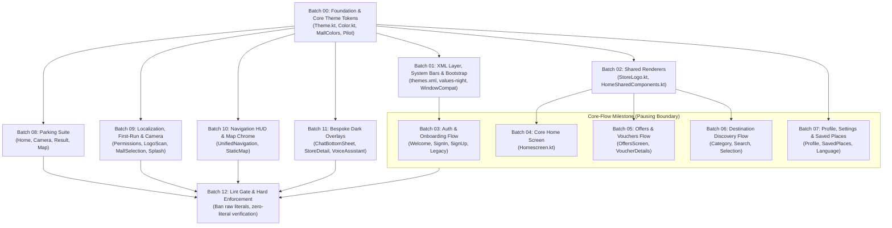

# MallAR — Light-Mode Colour Inventory & Screen Audit

> **Status**: Complete Inventory & Planning Specification  
> **Ticket Reference**: `.scratch/light-mode/issues/02-screen-color-inventory.md` (Frontier Ticket 02)  
> **Map**: `.scratch/light-mode/map.md`  
> **Scope**: Read-only codebase audit across all Compose UI files under `app/src/main/java/com/example/mallar/ui/**`, XML resources under `app/src/main/res/**`, and navigation routes from `MainActivity.kt`. **No application code modified.**

---

## Executive Summary

1. **Compose UI File Count & Split**:
   - Exactly **35 Kotlin files** exist under `app/src/main/java/com/example/mallar/ui/**`.
   - **24 Route Screens** registered in `MainActivity.kt`'s NavHost + **1 Unwired Route Screen** (`StoreDetailScreen.kt`) = **25 screen-level files**.
   - **4 Shared / Sub-Screen Renderers**: `HomeSharedComponents.kt`, `components/StoreLogo.kt`, `chatbot/ChatBottomSheet.kt`, and embedded confirmation layer `localization/LocalizationConfirmScreen.kt`.
   - **6 Non-Rendering Support Files**: ViewModels (`DestinationViewModel.kt`, `UnifiedNavigationViewModel.kt`), data/domain helper (`chatbot/ChatSystem.kt`), and theme definitions (`theme/Color.kt`, `theme/Theme.kt`, `theme/Type.kt`).
   - *(Companion finding)*: `app/src/main/java/com/example/mallar/voice/VoiceAssistantOverlay.kt` (511 lines, 13 hardcoded literals) is a full Compose overlay residing outside `ui/` with a complete bespoke dark palette matching XML `ai_*`.

2. **Hardcoded Color Literal Reality**:
   - Earlier charting recon estimated ~567 hardcoded `Color(0x…)` literals. Verification reveals **528 total occurrences of the word `Color` in `ui/**`**, but exactly **198 raw `Color(0x…)` hex literals** in `ui/**` (176 in screen/component files + 22 in `ui/theme/Color.kt`).
   - Across the entire repository, there are **214 raw `Color(0x…)` literals** (198 in `ui/**`, 13 in `voice/VoiceAssistantOverlay.kt`, 3 in `ar/render/GuidanceVisualFactory.kt`).
   - Standard colors (`Color.White`, `Color.Black`, `Color.Transparent`, `Color.Gray`, etc.) appear **176 times** in `ui/**`.
   - `.copy(alpha = …)` is called **214 times** in `ui/**`.
   - **Top 5 worst files by raw `Color(0x…)` literals in UI**:
     1. `theme/Color.kt` — 22 literals (or screen-level: `parking/ParkingHomeScreen.kt` — 19 literals)
     2. `parking/ParkingScanResultScreen.kt` — 17 literals
     3. `destination/DestinationSelectionScreen.kt` — 14 literals
     4. `parking/ParkingMapScreen.kt` — 14 literals
     5. `home/HomeSharedComponents.kt` — 13 literals
     *(Runner-up screen files: `home/Homescreen.kt` — 12 literals; `navigation/UnifiedNavigationScreen.kt` — 12 literals; companion `voice/VoiceAssistantOverlay.kt` — 13 literals)*.

3. **MaterialTheme.colorScheme & System Bar State**:
   - Only **3 files** read `MaterialTheme.colorScheme`: `LanguageScreen.kt`, `PermissionsScreen.kt`, and `ProfileScreen.kt`.
   - Only **2 files** touch `isAppearanceLightStatusBars`: `WelcomeScreen.kt` (sets `!isDarkMode`) and `SplashScreen.kt` (forces `false` / white icons). All other 33 files never set light/dark status bar icons, causing widespread invisible system bar icons on light backgrounds.

4. **XML Layer Reality (`colors.xml` & `themes.xml`)**:
   - **`res/values/colors.xml` contains 71 colors — and ALL 71 ARE 100% UNREFERENCED / DEAD.** Not a single layout, drawable, theme, or Kotlin file references `R.color.*` or `@color/*`. Compose developers re-implemented the palette with inline literals.
   - **`res/values/themes.xml` hardcodes `#06131A` directly** in `Theme.MallAR` and `Theme.App.Starting`. There is **NO `res/values-night/` directory**, and NO layout XML or menu XML files exist anywhere in the app (100% Compose UI).

5. **Migration Sizing**:
   - Sized realistically at **13 implementer sessions** (Batches 00–12), incorporating foundation, XML/system-bar bootstrap, shared renderers, core flow milestone, long-tail areas, bespoke dark palettes, and final lint-gate flip.

---

## 1. Route Manifest

Every destination registered in `MainActivity.kt`'s `NavHost` (`startDestination = "splash"`), mapped to its rendering file, route string, parameters, and notes:

| # | Route String | Target Composable | File Location | Nav Arguments | Notes |
|---|--------------|-------------------|---------------|---------------|-------|
| 1 | `splash` | `SplashScreen` | [`ui/splash/SplashScreen.kt`](file:///C:/Users/youss/Downloads/MallAR-main%2022/MallAR-main/app/src/main/java/com/example/mallar/ui/splash/SplashScreen.kt) | — | Initial cold-launch destination; pops to `mall_selection`. |
| 2 | `mall_selection` | `MallSelectionScreen` | [`ui/mall/MallSelectionScreen.kt`](file:///C:/Users/youss/Downloads/MallAR-main%2022/MallAR-main/app/src/main/java/com/example/mallar/ui/mall/MallSelectionScreen.kt) | — | Mall picker shown after splash. Routes to `welcome` (first launch) or `home`. |
| 3 | `welcome` | `WelcomeScreen` | [`ui/auth/WelcomeScreen.kt`](file:///C:/Users/youss/Downloads/MallAR-main%2022/MallAR-main/app/src/main/java/com/example/mallar/ui/auth/WelcomeScreen.kt) | — | Onboarding hero landing. Leads to `sign_in`, `sign_up`, or skips to `home`. |
| 4 | `sign_up` | `SignUpScreen` | [`ui/auth/SignUpScreen.kt`](file:///C:/Users/youss/Downloads/MallAR-main%2022/MallAR-main/app/src/main/java/com/example/mallar/ui/auth/SignUpScreen.kt) | — | Full registration flow. |
| 5 | `sign_in` | `SignInScreen` | [`ui/auth/SignInScreen.kt`](file:///C:/Users/youss/Downloads/MallAR-main%2022/MallAR-main/app/src/main/java/com/example/mallar/ui/auth/SignInScreen.kt) | — | Unified login (phone + OTP inline). |
| 6 | `phone_auth` | `PhoneAuthScreen` | [`ui/auth/PhoneAuthScreen.kt`](file:///C:/Users/youss/Downloads/MallAR-main%2022/MallAR-main/app/src/main/java/com/example/mallar/ui/auth/PhoneAuthScreen.kt) | — | Legacy route (kept for backward compatibility). |
| 7 | `otp_verify` | `OtpVerifyScreen` | [`ui/auth/OtpVerifyScreen.kt`](file:///C:/Users/youss/Downloads/MallAR-main%2022/MallAR-main/app/src/main/java/com/example/mallar/ui/auth/OtpVerifyScreen.kt) | — | Legacy route (kept for backward compatibility). |
| 8 | `permissions` | `PermissionsScreen` | [`ui/localization/PermissionsScreen.kt`](file:///C:/Users/youss/Downloads/MallAR-main%2022/MallAR-main/app/src/main/java/com/example/mallar/ui/localization/PermissionsScreen.kt) | — | Camera/Location/Motion permission gate before AR/scanning. |
| 9 | `home` | `HomeScreen` | [`ui/home/Homescreen.kt`](file:///C:/Users/youss/Downloads/MallAR-main%2022/MallAR-main/app/src/main/java/com/example/mallar/ui/home/Homescreen.kt) | — | Main hub (categories, popular stores, hero cards, bottom nav). |
| 10 | `destination_selection` | `DestinationSelectionScreen` | [`ui/destination/DestinationSelectionScreen.kt`](file:///C:/Users/youss/Downloads/MallAR-main%2022/MallAR-main/app/src/main/java/com/example/mallar/ui/destination/DestinationSelectionScreen.kt) | — | Dedicated store/amenity directory screen. |
| 11 | `destination_search` | `DestinationSearchScreen` | [`ui/destination/DestinationSearchScreen.kt`](file:///C:/Users/youss/Downloads/MallAR-main%2022/MallAR-main/app/src/main/java/com/example/mallar/ui/destination/DestinationSearchScreen.kt) | — | Full-text search with instant filter results. |
| 12 | `destination_category/{categoryKey}` | `DestinationCategoryScreen` | [`ui/destination/DestinationCategoryScreen.kt`](file:///C:/Users/youss/Downloads/MallAR-main%2022/MallAR-main/app/src/main/java/com/example/mallar/ui/destination/DestinationCategoryScreen.kt) | `categoryKey: String` | Filtered store list by category. |
| 13 | `offers` | `OffersScreen` | [`ui/home/OffersScreen.kt`](file:///C:/Users/youss/Downloads/MallAR-main%2022/MallAR-main/app/src/main/java/com/example/mallar/ui/home/OffersScreen.kt) | — | List of mall-wide vouchers and promotions. |
| 14 | `voucher/{voucherId}` | `VoucherDetailsScreen` | [`ui/home/VoucherDetailsScreen.kt`](file:///C:/Users/youss/Downloads/MallAR-main%2022/MallAR-main/app/src/main/java/com/example/mallar/ui/home/VoucherDetailsScreen.kt) | `voucherId: String` | Voucher details, redemption state, and QR code display. |
| 15 | `logo_scan_with_dest` | `LogoScanScreen` | [`ui/localization/LogoScanScreen.kt`](file:///C:/Users/youss/Downloads/MallAR-main%2022/MallAR-main/app/src/main/java/com/example/mallar/ui/localization/LogoScanScreen.kt) | `preselectedDestination=true` | Camera localization with destination pre-set. |
| 16 | `logo_scan` | `LogoScanScreen` | [`ui/localization/LogoScanScreen.kt`](file:///C:/Users/youss/Downloads/MallAR-main%2022/MallAR-main/app/src/main/java/com/example/mallar/ui/localization/LogoScanScreen.kt) | `preselectedDestination=false` | Standalone camera localization. |
| 17 | `navigation` | `UnifiedNavigationScreen` | [`ui/navigation/UnifiedNavigationScreen.kt`](file:///C:/Users/youss/Downloads/MallAR-main%2022/MallAR-main/app/src/main/java/com/example/mallar/ui/navigation/UnifiedNavigationScreen.kt) | — | Live AR camera view or 2D floor-plan guidance. |
| 18 | `static_map` | `StaticMapScreen` | [`ui/navigation/StaticMapScreen.kt`](file:///C:/Users/youss/Downloads/MallAR-main%2022/MallAR-main/app/src/main/java/com/example/mallar/ui/navigation/StaticMapScreen.kt) | — | Interactive 2D pan/zoom floor-plan map. |
| 19 | `saved_places` | `SavedPlacesScreen` | [`ui/profile/SavedPlacesScreen.kt`](file:///C:/Users/youss/Downloads/MallAR-main%2022/MallAR-main/app/src/main/java/com/example/mallar/ui/profile/SavedPlacesScreen.kt) | — | Bookmarked stores / favourites. |
| 20 | `profile` | `ProfileScreen` | [`ui/profile/ProfileScreen.kt`](file:///C:/Users/youss/Downloads/MallAR-main%2022/MallAR-main/app/src/main/java/com/example/mallar/ui/profile/ProfileScreen.kt) | — | User account, avatar picker, language link, logout. |
| 21 | `language` | `LanguageScreen` | [`ui/language/LanguageScreen.kt`](file:///C:/Users/youss/Downloads/MallAR-main%2022/MallAR-main/app/src/main/java/com/example/mallar/ui/language/LanguageScreen.kt) | — | Per-app language selector (triggers recreate). |
| 22 | `parking_home` | `ParkingHomeScreen` | [`ui/parking/ParkingHomeScreen.kt`](file:///C:/Users/youss/Downloads/MallAR-main%2022/MallAR-main/app/src/main/java/com/example/mallar/ui/parking/ParkingHomeScreen.kt) | — | Parking spot status, actions to save/locate car. |
| 23 | `parking_camera` | `ParkingCameraScreen` | [`ui/parking/ParkingCameraScreen.kt`](file:///C:/Users/youss/Downloads/MallAR-main%2022/MallAR-main/app/src/main/java/com/example/mallar/ui/parking/ParkingCameraScreen.kt) | — | Camera OCR capture of parking pillar/zone. |
| 24 | `parking_scan_result` | `ParkingScanResultScreen` | [`ui/parking/ParkingScanResultScreen.kt`](file:///C:/Users/youss/Downloads/MallAR-main%2022/MallAR-main/app/src/main/java/com/example/mallar/ui/parking/ParkingScanResultScreen.kt) | — | Review OCR parsed spot details, edit, save. |
| 25 | `parking_map` | `ParkingMapScreen` | [`ui/parking/ParkingMapScreen.kt`](file:///C:/Users/youss/Downloads/MallAR-main%2022/MallAR-main/app/src/main/java/com/example/mallar/ui/parking/ParkingMapScreen.kt) | — | Parking lot 2D layout & spot picker. |

### Unwired & Sub-Screen Composables Not in NavHost
- **`StoreDetailScreen`** ([`ui/home/StoreDetailScreen.kt`](file:///C:/Users/youss/Downloads/MallAR-main%2022/MallAR-main/app/src/main/java/com/example/mallar/ui/home/StoreDetailScreen.kt)): Full 257-line screen with top bar, logo card, and navigation action buttons. Currently **unwired** in `MainActivity.kt` (no route points to it).
- **`LocalizationConfirmScreen`** ([`ui/localization/LocalizationConfirmScreen.kt`](file:///C:/Users/youss/Downloads/MallAR-main%2022/MallAR-main/app/src/main/java/com/example/mallar/ui/localization/LocalizationConfirmScreen.kt)): Multi-tier human confirmation UI (558 lines), rendered as an embedded sub-screen inside `LogoScanScreen`.
- **`VoiceAssistantOverlay`** ([`voice/VoiceAssistantOverlay.kt`](file:///C:/Users/youss/Downloads/MallAR-main%2022/MallAR-main/app/src/main/java/com/example/mallar/voice/VoiceAssistantOverlay.kt)): Full-screen animated voice assistant overlay (511 lines), located under `voice/` package, currently unwired.

---

## 2. Part A — Compose Files Inventory

Classification Definitions:
- **`route screen`**: A top-level navigable destination in `MainActivity.kt`'s NavHost (or an unwired standalone screen).
- **`shared renderer`**: A composable or library of components rendered across 2+ screens.
- **`non-rendering support`**: ViewModel, state holder, pure data/helper, or theme infrastructure with no direct rendering surface.

### Table A1: Route Screens (25 files)

| File | Classification | Raw `0x` | Std `Color.*` | `Color.kt` / Home Constants | M3 / `remHome` | Gradients & `.copy(alpha)` | Dark Mode Branching | System Bars Handled | Light-Mode Verdict & Breakage Summary |
|------|----------------|----------|---------------|-----------------------------|----------------|----------------------------|---------------------|---------------------|---------------------------------------|
| [`auth/OtpVerifyScreen.kt`](file:///C:/Users/youss/Downloads/MallAR-main%2022/MallAR-main/app/src/main/java/com/example/mallar/ui/auth/OtpVerifyScreen.kt) | `route screen` (legacy) | 0 | `Transparent(2)` | `Teal(3)`, `White(11)` | None / No | 0 gradients, 4 copy | **No** (0 branches) | `statusBarsPadding`, `navigationBarsPadding` | **Light-only**. Hardcoded `Teal` background, white text/surfaces. Never adapts to dark mode. |
| [`auth/PhoneAuthScreen.kt`](file:///C:/Users/youss/Downloads/MallAR-main%2022/MallAR-main/app/src/main/java/com/example/mallar/ui/auth/PhoneAuthScreen.kt) | `route screen` (legacy) | 0 | 0 | `Teal(7)`, `White(9)` | None / No | 0 gradients, 3 copy | **No** (0 branches) | `statusBarsPadding`, `navigationBarsPadding` | **Light-only**. Hardcoded full `Teal` fill with white text and cards. Never adapts to dark mode. |
| [`auth/SignInScreen.kt`](file:///C:/Users/youss/Downloads/MallAR-main%2022/MallAR-main/app/src/main/java/com/example/mallar/ui/auth/SignInScreen.kt) | `route screen` | 8 | `Black(1)` | `Teal(4)`, `White(19)` | None / No | 1 vertical, 14 copy | **Yes** (3 branches) | `statusBarsPadding`, `navigationBarsPadding` | **Broken**. Light mode uses `SignInGradient` (teal gradient) with white text rather than an M3 light surface. Status bar icons never inverted. |
| [`auth/SignUpScreen.kt`](file:///C:/Users/youss/Downloads/MallAR-main%2022/MallAR-main/app/src/main/java/com/example/mallar/ui/auth/SignUpScreen.kt) | `route screen` | 8 | `Black(1)` | `Teal(6)`, `White(23)` | None / No | 1 vertical, 17 copy | **Broken**. Same as `SignInScreen`: hardcoded teal gradient in light mode, no system-bar icon inversion. |
| [`auth/WelcomeScreen.kt`](file:///C:/Users/youss/Downloads/MallAR-main%2022/MallAR-main/app/src/main/java/com/example/mallar/ui/auth/WelcomeScreen.kt) | `route screen` | 0 | `White(1)` | `Teal(5)`, `DarkBackground(1)`, `White(4)` | None / No | 0 gradients, 1 copy | **Yes** (6 branches) | `WindowCompat`, `isAppearanceLightStatusBars` | **Works**. One of only 2 screens that dynamically toggles `isAppearanceLightStatusBars = !isDarkMode`. Adapts bg/text. |
| [`destination/DestinationCategoryScreen.kt`](file:///C:/Users/youss/Downloads/MallAR-main%2022/MallAR-main/app/src/main/java/com/example/mallar/ui/destination/DestinationCategoryScreen.kt) | `route screen` | 0 | `White(1)` | `GlassCardBg(1)` | `rememberHomeColorScheme` (Yes) | 0 gradients, 1 copy | **Yes** (6 branches) | `statusBarsPadding` | **Broken**. Uses `DesignPurple` accent and `GlassCardBg`. Does not invert status bar icons (white on `#F7F9FA`). |
| [`destination/DestinationSearchScreen.kt`](file:///C:/Users/youss/Downloads/MallAR-main%2022/MallAR-main/app/src/main/java/com/example/mallar/ui/destination/DestinationSearchScreen.kt) | `route screen` | 0 | `White(1)` | `GlassCardBg(1)` | `rememberHomeColorScheme` (Yes) | 0 gradients, 3 copy | **Yes** (6 branches) | `statusBarsPadding` | **Broken**. Purple accent bleed, white status bar icons on light bg. |
| [`destination/DestinationSelectionScreen.kt`](file:///C:/Users/youss/Downloads/MallAR-main%2022/MallAR-main/app/src/main/java/com/example/mallar/ui/destination/DestinationSelectionScreen.kt) | `route screen` | 14 | `White(4)`, `Black(2)`, `Transparent(2)` | 14 screen-local `Dsel*` tokens | None / No | 4 gradients (vert, rad, lin), 20 copy | **Yes** (9 branches) | `statusBarsPadding` | **Broken**. Uses bespoke 14-token "Indigo-Violet" palette (`#5847E8`) conflicting with app Teal/Purple. Status bar icons stay white on light bg. |
| [`home/Homescreen.kt`](file:///C:/Users/youss/Downloads/MallAR-main%2022/MallAR-main/app/src/main/java/com/example/mallar/ui/home/Homescreen.kt) | `route screen` | 12 | `White(16)`, `Transparent(7)`, `Black(2)` | `DeepNavyBg`, `GlassCardBg`, `ParkingPurple`, `CyanGlow` | `rememberHomeColorScheme` (Yes) | 10 gradients (vert, rad, lin), 47 copy | **Yes** (35 branches) | `statusBarsPadding`, `navigationBarsPadding` | **Broken**. Severe contrast bugs: `CyanGlow` (`#19D3E6`) text on white (~1.2:1); `offer.tint` composited blindly; dark car graphic on white canvas; white status bar icons. |
| [`home/OffersScreen.kt`](file:///C:/Users/youss/Downloads/MallAR-main%2022/MallAR-main/app/src/main/java/com/example/mallar/ui/home/OffersScreen.kt) | `route screen` | 0 | `White(10)`, `Transparent(1)` | `DeepNavyBg`, `GlassCardBg`, `CyanGlow` | `rememberHomeColorScheme` (Yes) | 1 vertical, 9 copy | **Yes** (22 branches) | `statusBarsPadding` | **Broken**. Purple accent bleed, white-on-white card borders (`Color.White.copy(0.5f)`), status bar icons unmanaged. |
| [`home/StoreDetailScreen.kt`](file:///C:/Users/youss/Downloads/MallAR-main%2022/MallAR-main/app/src/main/java/com/example/mallar/ui/home/StoreDetailScreen.kt) | `route screen` (unwired) | 3 | `Black(4)`, `DarkGray(1)`, `Transparent(1)` | `Teal`, `TealLight`, `TextPrimary`, `RedAccent`, `DarkBackground`, `DarkCard` | None / No | 1 vertical, 5 copy | **Yes** (14 branches) | `statusBarsPadding` | **Broken**. Hardcoded `#FFF5F7FA` light bg, `#1A1A2E` dark gradient. Standalone screen unreferenced by NavHost. |
| [`home/VoucherDetailsScreen.kt`](file:///C:/Users/youss/Downloads/MallAR-main%2022/MallAR-main/app/src/main/java/com/example/mallar/ui/home/VoucherDetailsScreen.kt) | `route screen` | 0 | `White(7)`, `Black(4)` | `SuccessGreen(5)`, `GlassCardBg(2)` | `rememberHomeColorScheme` (Yes) | 1 vertical, 12 copy | **Yes** (8 branches) | `statusBarsPadding`, `navigationBarsPadding` | **Broken**. QR code hardcoded black/white (expected for barcode), but card background/borders and status bars unmanaged in light mode. |
| [`language/LanguageScreen.kt`](file:///C:/Users/youss/Downloads/MallAR-main%2022/MallAR-main/app/src/main/java/com/example/mallar/ui/language/LanguageScreen.kt) | `route screen` | 0 | 0 | `Teal(2)` | `MaterialTheme.colorScheme` (Yes) | 0 gradients, 1 copy | **Partial** (via M3) | `statusBarsPadding` | **Works**. Properly consumes M3 `colorScheme.background`, `surfaceVariant`, `onSurface`. Needs Teal token mapping. |
| [`localization/LogoScanScreen.kt`](file:///C:/Users/youss/Downloads/MallAR-main%2022/MallAR-main/app/src/main/java/com/example/mallar/ui/localization/LogoScanScreen.kt) | `route screen` | 5 | `Black(4)`, `White(2)`, `Gray(1)` | `Teal`, `DarkTeal`, `TextPrimary`, `RedAccent`, `SurfaceLight`, `DarkBackground`, `DarkCard` | None / No | 1 radial, 2 copy | **Yes** (30 branches) | `statusBarsPadding`, `navigationBarsPadding` | **Broken**. Camera viewfinder is inherently dark, but store selection sheets and prompt badges flip to white in light mode; status bars stay dark on camera. |
| [`localization/PermissionsScreen.kt`](file:///C:/Users/youss/Downloads/MallAR-main%2022/MallAR-main/app/src/main/java/com/example/mallar/ui/localization/PermissionsScreen.kt) | `route screen` | 3 | 0 | `Teal(2)`, `White(2)`, `SuccessGreen(4)`, `DividerColor(1)` | `MaterialTheme.colorScheme` (Yes) | 0 gradients, 3 copy | **Yes** (2 branches) | `navigationBarsPadding` | **Broken**. Hero section uses dark `background.png` with white logo, while bottom sheet uses `colorScheme.surface`. No status bar handling. |
| [`mall/MallSelectionScreen.kt`](file:///C:/Users/youss/Downloads/MallAR-main%2022/MallAR-main/app/src/main/java/com/example/mallar/ui/mall/MallSelectionScreen.kt) | `route screen` | 9 | `White(3)`, `Black(1)` | 6 local tokens (`NavyBg`, `CardBg`, `AccentPurple`, `TextMain`, `TextSub`, `ComingSoonBadge`) | None / No | 0 gradients, 8 copy | **Yes** (12 branches) | `statusBarsPadding`, `navigationBarsPadding` | **Broken**. On cold launch, SplashScreen forces white status bar icons. `MallSelectionScreen` renders `#F4F6FA` light bg → **status bar icons completely invisible**! |
| [`navigation/StaticMapScreen.kt`](file:///C:/Users/youss/Downloads/MallAR-main%2022/MallAR-main/app/src/main/java/com/example/mallar/ui/navigation/StaticMapScreen.kt) | `route screen` | 5 | `Black(5)`, `White(5)`, `Yellow(1)`, `Cyan(1)`, `Magenta(1)` | `Teal(2)`, `White(12)`, `RedAccent(1)`, local `PathTeal`, `StartGreen`, `EndRed` | None / No | 0 gradients, 11 copy | **No** (0 branches) | `statusBarsPadding`, `navigationBarsPadding` | **Always-dark / Broken**. Map background hardcoded `#121212`. Does not invert status bar icons (dark icons on dark map when coming from Welcome). |
| [`navigation/UnifiedNavigationScreen.kt`](file:///C:/Users/youss/Downloads/MallAR-main%2022/MallAR-main/app/src/main/java/com/example/mallar/ui/navigation/UnifiedNavigationScreen.kt) | `route screen` | 12 | `White(10)`, `Black(4)`, `Transparent(1)` | 12 local `Nav*` tokens | None / No | 0 gradients, 1 copy | **No** (0 branches) | `statusBarsPadding`, `navigationBarsPadding` | **Always-dark / Broken**. Entire screen is dark HUD (`#0A0F1E`) or camera feed. In light mode, status bar icons remain dark on dark background (unreadable). |
| [`parking/ParkingCameraScreen.kt`](file:///C:/Users/youss/Downloads/MallAR-main%2022/MallAR-main/app/src/main/java/com/example/mallar/ui/parking/ParkingCameraScreen.kt) | `route screen` | 4 | `White(8)`, `Black(5)` | `Teal`, `TextPrimary`, `DarkBackground`, `DarkTextPrimary` | None / No | 0 gradients, 8 copy | **Yes** (5 branches) | `statusBarsPadding`, `navigationBarsPadding` | **Always-dark / Broken**. Viewfinder camera preview is dark; permission fallback switches to white; system bar icons stay dark on black camera preview. |
| [`parking/ParkingHomeScreen.kt`](file:///C:/Users/youss/Downloads/MallAR-main%2022/MallAR-main/app/src/main/java/com/example/mallar/ui/parking/ParkingHomeScreen.kt) | `route screen` | 19 | `White(18)`, `Black(2)`, `Transparent(1)` | 7 local `Home*` tokens, `RedAccent`, `DarkBackground`, `DarkSurface`, `DarkCard` | None / No | 1 vertical, 1 copy | **Yes** (20 branches) | `statusBarsPadding` | **Broken**. Copied legacy palette (`HomePrimary #258799`). Heavy use of hardcoded cyan `#00BCD4` for icons/text on light surfaces. Invisible status bar. |
| [`parking/ParkingMapScreen.kt`](file:///C:/Users/youss/Downloads/MallAR-main%2022/MallAR-main/app/src/main/java/com/example/mallar/ui/parking/ParkingMapScreen.kt) | `route screen` | 14 | `Black(7)`, `White(2)` | 8 local `Home*` / path tokens, `Teal`, `DarkBackground`, `DarkCard` | None / No | 0 gradients, 11 copy | **Yes** (11 branches) | `statusBarsPadding`, `navigationBarsPadding` | **Broken**. Inconsistent dark surface tokens (`#1E1E2A`, `#363648`). Map canvas and path colors hardcoded. No light status bar icon control. |
| [`parking/ParkingScanResultScreen.kt`](file:///C:/Users/youss/Downloads/MallAR-main%2022/MallAR-main/app/src/main/java/com/example/mallar/ui/parking/ParkingScanResultScreen.kt) | `route screen` | 17 | `White(17)`, `Black(1)` | 5 local `Home*` tokens, `Teal`, `TextPrimary`, `DarkBackground`, `DarkSurface` | None / No | 0 gradients, 3 copy | **Yes** (10 branches) | `statusBarsPadding` | **Broken**. 17 raw literals! Hardcoded orange `#FF9800`, cyan `#00BCD4`, green `#00E676`. Unmanaged system bar icons. |
| [`profile/ProfileScreen.kt`](file:///C:/Users/youss/Downloads/MallAR-main%2022/MallAR-main/app/src/main/java/com/example/mallar/ui/profile/ProfileScreen.kt) | `route screen` | 0 | 0 | `Teal(7)`, `TealLight(1)`, `White(3)`, `RedAccent(2)` | `MaterialTheme.colorScheme` (Yes) | 1 linear, 7 copy | **Yes** (7 branches) | `statusBarsPadding`, `navigationBarsPadding` | **Works**. Cleanly reads `MaterialTheme.colorScheme`. Only needs `Teal`/`RedAccent` literal references mapped to tokens. |
| [`profile/SavedPlacesScreen.kt`](file:///C:/Users/youss/Downloads/MallAR-main%2022/MallAR-main/app/src/main/java/com/example/mallar/ui/profile/SavedPlacesScreen.kt) | `route screen` | 6 | 0 | 6 local `Saved*` tokens (`#258799`, `#F7F9FA`, `#1A1A2E`, etc.), `DarkBackground` | None / No | 0 gradients, 0 copy | **Yes** (11 branches) | `statusBarsPadding` | **Broken**. Duplicates old home screen palette under `Saved*` prefix. Uses hardcoded `StoreLogoContainer` (forces white). Status bars unmanaged. |
| [`splash/SplashScreen.kt`](file:///C:/Users/youss/Downloads/MallAR-main%2022/MallAR-main/app/src/main/java/com/example/mallar/ui/splash/SplashScreen.kt) | `route screen` | 4 | `White(8)`, `Transparent(1)` | `DesignPurple(10)`, local `DesignNavy`, `DesignCyan` | None / No | 2 radial, 13 copy | **No** (0 branches) | `WindowCompat`, `isAppearanceLightStatusBars`, `statusBarsPadding` | **Always-dark / Breaks Next Screen**. Pitch black (`#06131A`), forces white status bar icons (`isAppearanceLightStatusBars = false`), which poison subsequent light screens. |

---

### Table A2: Shared & Sub-Screen Renderers (4 files)

| File | Classification | Raw `0x` | Std `Color.*` | `Color.kt` / Home Constants | M3 / `remHome` | Gradients & `.copy(alpha)` | Dark Mode Branching | System Bars Handled | Light-Mode Verdict & Breakage Summary |
|------|----------------|----------|---------------|-----------------------------|----------------|----------------------------|---------------------|---------------------|---------------------------------------|
| [`chatbot/ChatBottomSheet.kt`](file:///C:/Users/youss/Downloads/MallAR-main%2022/MallAR-main/app/src/main/java/com/example/mallar/ui/chatbot/ChatBottomSheet.kt) | `shared renderer` (used in Home & LogoScan) | 8 | `White(8)`, `Gray(3)`, `Black(1)` | 4 local `Chat*` tokens (`ChatTeal`, `ChatBotBg`, etc.) | None / No | 0 gradients, 1 copy | **No** (0 branches) | `navigationBarsPadding` | **Light-only / Context clash**. Hardcoded white background (`ChatSheetBg = Color.White`), `#F5F5F5` bubble. When launched from camera (`LogoScanScreen`), flashes a blinding white sheet. In dark mode on Home, sheet remains white. |
| [`components/StoreLogo.kt`](file:///C:/Users/youss/Downloads/MallAR-main%2022/MallAR-main/app/src/main/java/com/example/mallar/ui/components/StoreLogo.kt) | `shared renderer` (used in Home, Search, Saved, Detail) | 2 | `White(1)` | Local `LogoPrimary #258799` | None / No | 0 gradients, 1 copy | **No** (0 branches) | None | **Light-only**. `StoreLogoContainer` forces hardcoded `background(Color.White)` even in dark mode. No placeholder / error surfaces. `crossfade(false)`. |
| [`home/HomeSharedComponents.kt`](file:///C:/Users/youss/Downloads/MallAR-main%2022/MallAR-main/app/src/main/java/com/example/mallar/ui/home/HomeSharedComponents.kt) | `shared renderer` (gates Home, Offers, Vouchers, Destination) | 13 | `White(16)`, `Black(4)` | 11 design tokens (`DeepNavyBg`, `GlassCardBg`, `DesignPurple`, `CyanGlow`, etc.) | `rememberHomeColorScheme` (Defines) | 0 gradients, 23 copy | **Yes** (20 branches) | `navigationBarsPadding` | **Broken**. Central point of failure: defines `DesignPurple` accent (`#9D5CFF`), dark glass card background (`#0D1E26`), and low-contrast borders (`Color.Black.copy(0.05f)`). Gates all screens that read `rememberHomeColorScheme`. |
| [`localization/LocalizationConfirmScreen.kt`](file:///C:/Users/youss/Downloads/MallAR-main%2022/MallAR-main/app/src/main/java/com/example/mallar/ui/localization/LocalizationConfirmScreen.kt) | `shared renderer` / embedded sub-screen (in LogoScan) | 10 | `Black(2)`, `Transparent(1)` | `Teal(8)`, `White(4)`, `TextPrimary(5)`, `TextSecondary(14)`, `SurfaceLight(3)` | None / No | 1 radial, 13 copy | **No** (0 branches) | `navigationBarsPadding` | **Always-dark / Camera overlay**. Renders over camera feed in `LogoScanScreen`. Hardcoded green `#00C853`, amber `#FFA000`, red `#E53935` for localization tiers. Ignores dark mode preference (correct for camera overlay). |

---

### Table A3: Non-Rendering Support Files (6 files)

| File | Classification | Lines | Raw `0x` | Purpose & Colour Concerns |
|------|----------------|-------|----------|---------------------------|
| [`chatbot/ChatSystem.kt`](file:///C:/Users/youss/Downloads/MallAR-main%2022/MallAR-main/app/src/main/java/com/example/mallar/ui/chatbot/ChatSystem.kt) | `non-rendering support` | 292 | 0 | Pure NLP query parser, regexes, and A* text generator. **No UI surfaces or colors.** No-op for migration. |
| [`destination/DestinationViewModel.kt`](file:///C:/Users/youss/Downloads/MallAR-main%2022/MallAR-main/app/src/main/java/com/example/mallar/ui/destination/DestinationViewModel.kt) | `non-rendering support` | 68 | 0 | State holder for destination filtering/searching. **No UI surfaces or colors.** No-op for migration. |
| [`navigation/UnifiedNavigationViewModel.kt`](file:///C:/Users/youss/Downloads/MallAR-main%2022/MallAR-main/app/src/main/java/com/example/mallar/ui/navigation/UnifiedNavigationViewModel.kt) | `non-rendering support` | 289 | 0 | State machine for AR pose, orientation, and navigation route calculation. **No UI surfaces or colors.** No-op for migration. |
| [`theme/Color.kt`](file:///C:/Users/youss/Downloads/MallAR-main%2022/MallAR-main/app/src/main/java/com/example/mallar/ui/theme/Color.kt) | `non-rendering support` | 31 | 22 | Defines 22 global `val` color constants (`Teal`, `DarkTeal`, `DarkBackground`, etc.). **Foundation boundary**: to be replaced/extended by central token definitions. |
| [`theme/Theme.kt`](file:///C:/Users/youss/Downloads/MallAR-main%2022/MallAR-main/app/src/main/java/com/example/mallar/ui/theme/Theme.kt) | `non-rendering support` | 73 | 0 | `MallARTheme` definition, binds `MallARLightScheme` / `MallARDarkScheme` and typography. Missing ~20 standard M3 color roles (Codex C1). **Foundation boundary**. |
| [`theme/Type.kt`](file:///C:/Users/youss/Downloads/MallAR-main%2022/MallAR-main/app/src/main/java/com/example/mallar/ui/theme/Type.kt) | `non-rendering support` | 124 | 0 | Typography scale and Cairo font loader. **No UI color surfaces.** No-op for migration. |

---

### Table A4: External Companion Component (Outside `ui/`)

| File | Classification | Raw `0x` | Std `Color.*` | Local Tokens | Dark Branching | Verdict & Notes |
|------|----------------|----------|---------------|--------------|----------------|-----------------|
| [`voice/VoiceAssistantOverlay.kt`](file:///C:/Users/youss/Downloads/MallAR-main%2022/MallAR-main/app/src/main/java/com/example/mallar/voice/VoiceAssistantOverlay.kt) | `shared renderer` (voice overlay) | 13 | `White`, `Black`, `Transparent` | `AiBlue`, `AiBlueDeep`, `AiPurple`, `AiCard`, `AiSurface`, `AiSuccess`, `AiError`, `AiText`, `AiTextMuted` | **No** (0 branches) | **Always-dark / Broken**. 511-line full-screen animated waveform overlay. Defined in `package com.example.mallar.voice`. Uses identical hex values to `colors.xml` `ai_*` cluster. Never branches on `isDarkMode`. |

---

## 3. Part B — XML Layer Inventory

### 1. `res/values/themes.xml`
```xml
<!-- Main Application Theme -->
<style name="Theme.MallAR" parent="Theme.AppCompat.DayNight.NoActionBar">
    <item name="android:windowBackground">#06131A</item>
    <item name="android:statusBarColor">#06131A</item>
    <item name="android:navigationBarColor">#06131A</item>
</style>

<!-- Android 12+ Splash Screen API Theme -->
<style name="Theme.App.Starting" parent="Theme.SplashScreen">
    <item name="windowSplashScreenBackground">#06131A</item>
    <item name="windowSplashScreenAnimatedIcon">@drawable/logo_main</item>
    <item name="postSplashScreenTheme">@style/Theme.MallAR</item>
</style>
```

#### Defect Analysis
1. **Hardcoded Pitch Black Window Background**: Both `Theme.MallAR` and `Theme.App.Starting` hardcode `#06131A` directly in XML.
2. **Missing `values-night/` Directory**: There is no `res/values-night/themes.xml`. When Android creates the window surface before Compose boots, it initializes a pitch-black `#06131A` window even in light mode.
3. **No Reference to `colors.xml`**: Themes do not even use `@color/teal_primary` or `@color/nav_surface`; they hardcode raw hex `#06131A`.
4. **DayNight / Compose Split**: `parent="Theme.AppCompat.DayNight.NoActionBar"` expects AppCompat system night-mode switching, but the app relies solely on Compose `AppPreferences.isDarkMode`.

---

### 2. `res/values/colors.xml` (71 Defined Colours — Complete Audit)

Every color defined in `res/values/colors.xml` was queried across the entire repository (`app/src/main/**`) for references (`@color/name`, `R.color.name`, `colorResource(R.color.name)`).

> **CRITICAL DISCOVERY**: **ALL 71 COLORS IN `colors.xml` ARE 100% DEAD.**  
> Zero XML layouts, zero drawables, zero themes, and zero Kotlin files reference any of these colors. The Kotlin code re-declared all color values as private literals or constants.

| # | XML Color Name | Hex Value | Semantic Cluster | Actual Disposition in Codebase |
|---|----------------|-----------|------------------|---------------------------------|
| 1 | `teal_primary` | `#FF1A8C8C` | Brand Colors | **DEAD** (Re-declared in `Color.kt` as `val Teal = Color(0xFF1A8C8C)`) |
| 2 | `teal_dark` | `#FF0F5F5F` | Brand Colors | **DEAD** (Re-declared in `Color.kt` as `val DarkTeal = Color(0xFF0F5F5F)`) |
| 3 | `white` | `#FFFFFFFF` | Brand Colors | **DEAD** (Re-declared in `Color.kt` as `val White = Color(0xFFFFFFFF)`) |
| 4 | `text_primary` | `#FF1A1A1A` | Brand Colors | **DEAD** (Re-declared in `Color.kt` as `val TextPrimary = Color(0xFF1A1A1A)`) |
| 5 | `text_secondary` | `#FF666666` | Brand Colors | **DEAD** (Re-declared in `Color.kt` as `val TextSecondary = Color(0xFF666666)`) |
| 6 | `camera_placeholder` | `#FF222222` | Brand Colors | **DEAD** (Re-declared in `Color.kt` as `val CameraPlaceholder`) |
| 7 | `light_gray` | `#FFF0F0F0` | Brand Colors | **DEAD** (Re-declared in `Color.kt` as `val LightGray`) |
| 8 | `red_accent` | `#FFE53935` | Brand Colors | **DEAD** (Re-declared in `Color.kt` as `val RedAccent`) |
| 9 | `green_arrow` | `#FF4CAF50` | Brand Colors | **DEAD** (Re-declared in `Color.kt` as `val GreenArrow`) |
| 10 | `home_primary` | `#FF258799` | Home / Saved Places | **DEAD** (Re-declared locally in `ParkingHomeScreen`, `ParkingMapScreen`, `SavedPlacesScreen`) |
| 11 | `home_primary_light` | `#FF2FA3B8` | Home / Saved Places | **DEAD** (Re-declared locally in `ParkingHomeScreen`, `ParkingMapScreen`, `SavedPlacesScreen`) |
| 12 | `home_primary_dark` | `#FF1A6B78` | Home / Saved Places | **DEAD** (Re-declared locally in `ParkingHomeScreen`) |
| 13 | `home_surface` | `#FFF7F9FA` | Home / Saved Places | **DEAD** (Re-declared locally in `ParkingHomeScreen`, `ParkingMapScreen`, `SavedPlacesScreen`) |
| 14 | `home_card` | `#FFFFFFFF` | Home / Saved Places | **DEAD** (Re-declared locally in `ParkingHomeScreen`, `ParkingMapScreen`, `SavedPlacesScreen`) |
| 15 | `home_text_main` | `#FF1A1A2E` | Home / Saved Places | **DEAD** (Re-declared locally in `ParkingHomeScreen`, `ParkingMapScreen`, `SavedPlacesScreen`) |
| 16 | `home_text_sub` | `#FF888EA8` | Home / Saved Places | **DEAD** (Re-declared locally in `ParkingHomeScreen`, `ParkingMapScreen`, `SavedPlacesScreen`) |
| 17 | `home_red` | `#FFE53935` | Home / Saved Places | **DEAD** |
| 18 | `nav_blue` | `#FF1E64FF` | Unified Navigation | **DEAD** (Re-declared locally in `UnifiedNavigationScreen.kt` as `NavBlue`) |
| 19 | `nav_blue_dark` | `#FF0A3DBF` | Unified Navigation | **DEAD** (Re-declared locally in `UnifiedNavigationScreen.kt` as `NavBlueDark`) |
| 20 | `nav_green` | `#FF00C853` | Unified Navigation | **DEAD** (Re-declared locally in `UnifiedNavigationScreen.kt` as `NavGreen`) |
| 21 | `nav_amber` | `#FFFFA726` | Unified Navigation | **DEAD** (Re-declared locally in `UnifiedNavigationScreen.kt` as `NavAmber`) |
| 22 | `nav_surface` | `#FF0A0F1E` | Unified Navigation | **DEAD** (Re-declared locally in `UnifiedNavigationScreen.kt` as `NavSurface`) |
| 23 | `nav_card` | `#F0121829` | Unified Navigation | **DEAD** (Re-declared locally in `UnifiedNavigationScreen.kt` as `NavCard`) |
| 24 | `path_color` | `#FF00BCD4` | Unified Navigation | **DEAD** (Re-declared locally in `UnifiedNavigationScreen.kt` as `PathColor`) |
| 25 | `path_shadow` | `#99006064` | Unified Navigation | **DEAD** (Re-declared locally in `UnifiedNavigationScreen.kt` as `PathShadow`) |
| 26 | `start_green` | `#FF43A047` | Unified Navigation | **DEAD** (Re-declared locally in `UnifiedNavigationScreen.kt` & `StaticMapScreen.kt`) |
| 27 | `end_red` | `#FFE53935` | Unified Navigation | **DEAD** (Re-declared locally in `UnifiedNavigationScreen.kt` & `StaticMapScreen.kt`) |
| 28 | `user_blue` | `#FF2979FF` | Unified Navigation | **DEAD** (Re-declared locally in `UnifiedNavigationScreen.kt` as `UserBlue`) |
| 29 | `walked_color` | `#886E6E6E` | Unified Navigation | **DEAD** (Re-declared locally in `UnifiedNavigationScreen.kt` as `WalkedColor`) |
| 30 | `permission_camera` | `#FF167D92` | Permissions Screen | **DEAD** (Replaced by raw literal `Color(0xFF167D92)` in `PermissionsScreen.kt`) |
| 31 | `permission_location` | `#FF2099B9` | Permissions Screen | **DEAD** (Replaced by raw literal `Color(0xFF2099B9)` in `PermissionsScreen.kt`) |
| 32 | `permission_motion` | `#FFC39D51` | Permissions Screen | **DEAD** (Replaced by raw literal `Color(0xFFC39D51)` in `PermissionsScreen.kt`) |
| 33 | `auth_gradient_0` | `#FF0F6B6B` | Auth Gradient (Light) | **DEAD** (Re-declared locally in `SignInScreen.kt` & `SignUpScreen.kt`) |
| 34 | `auth_gradient_1` | `#FF1A8C8C` | Auth Gradient (Light) | **DEAD** (Re-declared locally in `SignInScreen.kt` & `SignUpScreen.kt`) |
| 35 | `auth_gradient_2` | `#FF2FA3B8` | Auth Gradient (Light) | **DEAD** (Re-declared locally in `SignInScreen.kt` & `SignUpScreen.kt`) |
| 36 | `auth_gradient_3` | `#FF1A8C8C` | Auth Gradient (Light) | **DEAD** (Re-declared locally in `SignInScreen.kt` & `SignUpScreen.kt`) |
| 37 | `dark_gradient_0` | `#FF051717` | Auth Gradient (Dark) | **DEAD** (Re-declared locally in `SignInScreen.kt` & `SignUpScreen.kt`) |
| 38 | `dark_gradient_1` | `#FF0A2D2D` | Auth Gradient (Dark) | **DEAD** (Re-declared locally in `SignInScreen.kt` & `SignUpScreen.kt`) |
| 39 | `dark_gradient_2` | `#FF0E3A42` | Auth Gradient (Dark) | **DEAD** (Re-declared locally in `SignInScreen.kt` & `SignUpScreen.kt`) |
| 40 | `dark_gradient_3` | `#FF0A2D2D` | Auth Gradient (Dark) | **DEAD** (Re-declared locally in `SignInScreen.kt` & `SignUpScreen.kt`) |
| 41 | `store_detail_bg_light` | `#FFF5F7FA` | Store Detail | **DEAD** (Replaced by literal `Color(0xFFF5F7FA)` in `StoreDetailScreen.kt`) |
| 42 | `store_detail_gradient_start` | `#FF1A1A2E` | Store Detail | **DEAD** (Replaced by literal `Color(0xFF1A1A2E)` in `StoreDetailScreen.kt`) |
| 43 | `store_detail_gradient_end` | `#FF16213E` | Store Detail | **DEAD** (Replaced by literal `Color(0xFF16213E)` in `StoreDetailScreen.kt`) |
| 44 | `path_teal` | `#FF00897B` | Static Map | **DEAD** (Re-declared locally in `StaticMapScreen.kt` as `PathTeal`) |
| 45 | `path_outline` | `#FF004D40` | Static Map | **DEAD** (Replaced by literal `Color(0xFF004D40)` in `StaticMapScreen.kt`) |
| 46 | `static_map_bg` | `#FF121212` | Static Map | **DEAD** (Replaced by literal `Color(0xFF121212)` in `StaticMapScreen.kt`) |
| 47 | `ai_blue` | `#FF00BCD4` | AI Voice Assistant | **DEAD** (Re-declared locally in `voice/VoiceAssistantOverlay.kt` as `AiBlue`) |
| 48 | `ai_blue_deep` | `#FF006064` | AI Voice Assistant | **DEAD** (Re-declared locally in `voice/VoiceAssistantOverlay.kt` as `AiBlueDeep`) |
| 49 | `ai_purple` | `#FF7C4DFF` | AI Voice Assistant | **DEAD** (Re-declared locally in `voice/VoiceAssistantOverlay.kt` as `AiPurple`) |
| 50 | `ai_card` | `#FF0D1B2A` | AI Voice Assistant | **DEAD** (Re-declared locally in `voice/VoiceAssistantOverlay.kt` as `AiCard`) |
| 51 | `ai_surface` | `#FF112240` | AI Voice Assistant | **DEAD** (Re-declared locally in `voice/VoiceAssistantOverlay.kt` as `AiSurface`) |
| 52 | `ai_success` | `#FF00E676` | AI Voice Assistant | **DEAD** (Re-declared locally in `voice/VoiceAssistantOverlay.kt` as `AiSuccess`) |
| 53 | `ai_error` | `#FFFF5252` | AI Voice Assistant | **DEAD** (Re-declared locally in `voice/VoiceAssistantOverlay.kt` as `AiError`) |
| 54 | `ai_text` | `#FFE8F4F8` | AI Voice Assistant | **DEAD** (Re-declared locally in `voice/VoiceAssistantOverlay.kt` as `AiText`) |
| 55 | `ai_text_muted` | `#FF78909C` | AI Voice Assistant | **DEAD** (Re-declared locally in `voice/VoiceAssistantOverlay.kt` as `AiTextMuted`) |
| 56 | `ai_mic_bg_inactive_start` | `#FF1A3550` | AI Voice Assistant | **DEAD** (Replaced by literal in `voice/VoiceAssistantOverlay.kt`) |
| 57 | `ai_mic_bg_inactive_end` | `#FF0D1B2A` | AI Voice Assistant | **DEAD** (Replaced by literal in `voice/VoiceAssistantOverlay.kt`) |
| 58 | `chat_teal` | `#FF009688` | Chat Dialog | **DEAD** (Re-declared locally in `ChatBottomSheet.kt` as `ChatTeal`) |
| 59 | `chat_teal_light` | `#FFE0F2F1` | Chat Dialog | **DEAD** (Re-declared locally in `ChatBottomSheet.kt` as `ChatTealLight`) |
| 60 | `chat_bot_bg` | `#FFF5F5F5` | Chat Dialog | **DEAD** (Re-declared locally in `ChatBottomSheet.kt` as `ChatBotBg`) |
| 61 | `chat_bot_text` | `#FF212121` | Chat Dialog | **DEAD** (Re-declared locally in `ChatBottomSheet.kt` as `ChatBotText`) |
| 62 | `chat_divider` | `#FFEEEEEE` | Chat Dialog | **DEAD** (Replaced by literal `Color(0xFFEEEEEE)` in `ChatBottomSheet.kt`) |
| 63 | `chat_drag_handle` | `#FFDDDDDD` | Chat Dialog | **DEAD** (Replaced by literal `Color(0xFFDDDDDD)` in `ChatBottomSheet.kt`) |
| 64 | `chat_send_disabled` | `#FFBDBDBD` | Chat Dialog | **DEAD** (Replaced by literal `Color(0xFFBDBDBD)` in `ChatBottomSheet.kt`) |
| 65 | `camera_path_dot` | `#FF258799` | Camera Custom View | **DEAD** |
| 66 | `camera_beacon` | `#FF32CD64` | Camera Custom View | **DEAD** |
| 67 | `camera_arrow_bg` | `#C8258799` | Camera Custom View | **DEAD** |
| 68 | `home_gradient_dark_mid` | `#FF0A3D42` | Home Gradient | **DEAD** (Replaced by literal `Color(0xFF0A3D42)` in `Homescreen.kt`) |
| 69 | `home_gradient_light_mid` | `#FF9DD8E2` | Home Gradient | **DEAD** (Replaced by literal `Color(0xFF9DD8E2)` in `Homescreen.kt`) |
| 70 | `home_gradient_light_end` | `#FFE8F6F8` | Home Gradient | **DEAD** (Replaced by literal `Color(0xFFE8F6F8)` in `Homescreen.kt`) |
| 71 | `home_search_icon_inactive`| `#FFAAAAAA` | Home Gradient | **DEAD** |

---

### 3. XML Drawables & Other Resources Audit

| File | Type | Colors / Attributes Used | Disposition & Migration Action |
|------|------|--------------------------|--------------------------------|
| `res/drawable/ic_launcher_background.xml` | Vector Drawable | `android:fillColor="#FFFFFF"` | Hardcoded white background for adaptive launcher icon. Keep static. |
| `res/drawable/ic_launcher_foreground.xml` | Inset Drawable | Insets `@drawable/logoo_cropped` | No color declarations. Static brand icon. |
| `res/drawable/ic_mallar_logo.xml` | Vector Drawable | `android:fillColor="#FFFFFF"` (location pin), `android:fillColor="#1A8C8C"` (bag body), `android:fillColor="#0F5F5F"` (bag top/handles), `@android:color/transparent` | Static brand logo graphic. Uses Teal brand colors. Should NOT change with theme. |
| `res/drawable/ic_nav_arrow.xml` | Vector Drawable | `android:fillColor="#4CAF50"`, `android:fillColor="#66BB6A"` | Large green navigation arrow graphic. Keep static or reference status token. |
| `res/mipmap-anydpi-v26/ic_launcher.xml` | Adaptive Icon | Wraps background & foreground | No colors. |
| `res/mipmap-anydpi-v26/ic_launcher_round.xml` | Adaptive Icon | Wraps background & foreground | No colors. |
| `res/layout/` | Directory | **Does not exist** | 100% Compose app. Zero legacy layouts. |
| `res/menu/` | Directory | **Does not exist** | 100% Compose app. Zero XML menus. |

---

## 4. Proposed Migration Batch Grouping (~13 Implementer Sessions)

To ensure each batch is realistically sized for a single implementer session with clear acceptance criteria and no cyclic dependencies, the migration is structured into **13 sessions (Batches 00–12)**.

### Dependency Flow & Architecture Gates


---

### Detailed Batch Specifications

#### Batch 00: Foundation Architecture & Token Infrastructure
- **Files**: `ui/theme/Color.kt`, `ui/theme/Theme.kt`, new `ui/theme/MallColors.kt`, `ui/language/LanguageScreen.kt` (pilot).
- **Scope**:
  1. Build the hybrid token architecture: complete standard M3 `ColorScheme` (eliminating library purple defaults; Codex C1) + `MallColors` extension via `CompositionLocalProvider`.
  2. Implement synchronous dark-mode preference bootstrap (Codex C4) so initial frame renders without theme flash.
  3. Migrate pilot screen (`LanguageScreen.kt` — already reads M3 `colorScheme`).
- **Estimated Size**: 4 files, ~22 literals migrated in foundation, 0 in pilot.

#### Batch 01: XML Layer, System Bar Strategy & Bootstrap
- **Files**: `res/values/themes.xml`, new `res/values-night/themes.xml`, `res/values/colors.xml`, `MainActivity.kt`.
- **Scope**:
  1. Create `res/values-night/themes.xml` so Android window background correctly reflects light/dark before first frame.
  2. Clean up or populate `colors.xml` with authoritative window background attributes.
  3. Establish the route-aware system-bar contract (`WindowInsetsControllerCompat`, `isAppearanceLightStatusBars`, `isAppearanceLightNavigationBars`) with automatic restore-on-navigate (Codex C3).
- **Estimated Size**: 4 XML/build files, 1 Activity file.

#### Batch 02: Shared Renderers & Base Components (Gating Batch)
- **Files**: `ui/components/StoreLogo.kt`, `ui/home/HomeSharedComponents.kt`.
- **Scope**:
  1. `StoreLogo.kt`: Eliminate hardcoded `Color.White` container; implement theme-aware background container and error/placeholder states (Codex C12).
  2. `HomeSharedComponents.kt`: Retire `rememberHomeColorScheme` in favor of `LocalMallColors.current`; replace `DesignPurple` with Teal primary; convert `GlowingSearchBar`, `PopularStoreCard`, `StoreRow`, `CategoryChip` to tokens.
- **Estimated Size**: 2 files, 15 raw literals, 24 `.copy(alpha)` usages.

#### Batch 03: Auth & Onboarding Flow
- **Files**: `ui/auth/WelcomeScreen.kt`, `ui/auth/SignInScreen.kt`, `ui/auth/SignUpScreen.kt`, `ui/auth/PhoneAuthScreen.kt`, `ui/auth/OtpVerifyScreen.kt`.
- **Scope**:
  1. Eliminate `SignInGradient` / `DarkGradientColors` literal arrays.
  2. Migrate `WelcomeScreen` buttons and text to theme tokens.
  3. Convert legacy `PhoneAuthScreen` and `OtpVerifyScreen` to adapt to dark mode (retiring full teal background).
- **Estimated Size**: 5 files, 16 raw literals, 39 `.copy(alpha)` usages.

#### Batch 04: Core Home Screen
- **Files**: `ui/home/Homescreen.kt`.
- **Scope**:
  1. Largest single UI screen (1102 lines).
  2. Eliminate 12 raw `0x` literals and 47 `.copy(alpha)` instances.
  3. Fix severe `CyanGlow` contrast failure on floor badges (switch to AA-compliant text token).
  4. Convert `ParkingCarIllustration` hardcoded dark paths (`#0F2633`, `#0A1720`) to light/dark vector tokens.
  5. Harmonize `BottomNav` pill bar and `sampleOffers` data tints.
- **Estimated Size**: 1 file, 12 raw literals, 47 `.copy(alpha)` usages.

#### Batch 05: Offers & Vouchers Flow
- **Files**: `ui/home/OffersScreen.kt`, `ui/home/VoucherDetailsScreen.kt`.
- **Scope**:
  1. Migrate offer card borders and backgrounds from `GlassCardBg` to `LocalMallColors`.
  2. Replace `SuccessGreen` literal and redemption animation glow with semantic status tokens.
  3. Maintain hardcoded high-contrast black/white for QR code canvas (functional requirement).
- **Estimated Size**: 2 files, 0 raw literals (heavy named constant usage), 21 `.copy(alpha)` usages.

#### Batch 06: Destination Discovery Flow
- **Files**: `ui/destination/DestinationCategoryScreen.kt`, `ui/destination/DestinationSearchScreen.kt`, `ui/destination/DestinationSelectionScreen.kt`.
- **Scope**:
  1. Harmonize `DestinationSelectionScreen.kt`: retire the 14-token "Indigo-Violet" system (`Dsel*`) and converge onto app-wide Teal and surface tokens.
  2. Migrate `DestinationCategoryScreen` and `DestinationSearchScreen` from `rememberHomeColorScheme` to theme tokens.
- **Estimated Size**: 3 files, 14 raw literals, 24 `.copy(alpha)` usages.

#### Batch 07: Profile, Settings & Saved Places
- **Files**: `ui/profile/ProfileScreen.kt`, `ui/profile/SavedPlacesScreen.kt`.
- **Scope**:
  1. `ProfileScreen.kt`: Replace `Teal`, `TealLight`, `RedAccent` named constants with M3 tokens.
  2. `SavedPlacesScreen.kt`: Eliminate 6 local `Saved*` duplicate tokens; adopt `LocalMallColors.current.cardBackground`.
- **Estimated Size**: 2 files, 6 raw literals, 7 `.copy(alpha)` usages.

> **MILESTONE CHECKPOINT**: End of Batch 07 completes the **Core-Flow Milestone** (codex C10). At this checkpoint, every screen a regular shopper touches (Home, Auth, Offers, Search, Profile, Settings) has flawless light and dark mode with verified contrast and synchronized system bars.

#### Batch 08: Parking Suite
- **Files**: `ui/parking/ParkingHomeScreen.kt`, `ui/parking/ParkingCameraScreen.kt`, `ui/parking/ParkingScanResultScreen.kt`, `ui/parking/ParkingMapScreen.kt`.
- **Scope**:
  1. Major literal hotspot: 54 raw `Color(0x…)` literals across 4 files.
  2. Eliminate duplicate `Home*` palette definitions (`#258799`, `#F7F9FA`, `#1A1A2E`).
  3. Harmonize OCR result tags (`#FF9800`, `#00E676`, `#00BCD4`).
  4. Ensure `ParkingCameraScreen` keeps always-dark camera viewfinder chrome while adapting permission fallback.
- **Estimated Size**: 4 files, 54 raw literals, 23 `.copy(alpha)` usages.

#### Batch 09: Localization, First-Run & Camera Viewfinders
- **Files**: `ui/localization/PermissionsScreen.kt`, `ui/localization/LogoScanScreen.kt`, `ui/localization/LocalizationConfirmScreen.kt`, `ui/mall/MallSelectionScreen.kt`, `ui/splash/SplashScreen.kt`.
- **Scope**:
  1. `MallSelectionScreen`: Fix cold-start invisible status bar icons; migrate 9 raw literals to tokens.
  2. `SplashScreen`: Resolve brand splash vs theme splash; fix `isAppearanceLightStatusBars = false` side effect.
  3. `LogoScanScreen` & `LocalizationConfirmScreen`: Define always-dark viewfinder chrome; ensure store selection sheets adapt properly in light mode without dark bleed.
- **Estimated Size**: 5 files, 31 raw literals, 28 `.copy(alpha)` usages.

#### Batch 10: Navigation HUD & Map Chrome
- **Files**: `ui/navigation/UnifiedNavigationScreen.kt`, `ui/navigation/StaticMapScreen.kt`.
- **Scope**:
  1. Eliminate 17 raw `Color(0x…)` literals.
  2. Separate 2D Compose HUD / map indicators (`NavBlue`, `PathColor`, `StartGreen`, `EndRed`) from 3D ARCore engine rendering.
  3. Model always-dark HUD tokens for `NavCard` (`#F0121829`) and `NavSurface` (`#0A0F1E`).
  4. Fix status bar icon contrast over dark map/camera canvases.
- **Estimated Size**: 2 files, 17 raw literals, 12 `.copy(alpha)` usages.

#### Batch 11: Bespoke Dark Components & Overlays
- **Files**: `ui/chatbot/ChatBottomSheet.kt`, `ui/home/StoreDetailScreen.kt`, `voice/VoiceAssistantOverlay.kt`.
- **Scope**:
  1. `ChatBottomSheet.kt`: Convert from light-only to dual-mode sheet; resolve high-contrast presentation when opened from camera view.
  2. `StoreDetailScreen.kt`: Replace 3 raw literals and `#1A1A2E` gradient with theme tokens.
  3. `VoiceAssistantOverlay.kt`: Tokenize the 13 raw `Ai*` literals using always-dark overlay tokens.
- **Estimated Size**: 3 files, 24 raw literals, 12 `.copy(alpha)` usages.

#### Batch 12: Lint Gate & Hard Enforcement Flip
- **Files**: Lint configuration (`detekt.yml` or custom Android Lint rule), codebase-wide verification.
- **Scope**:
  1. Verify zero raw `Color(0x…)` literals remain in `ui/**` outside `ui/theme/`.
  2. Verify zero unreferenced colors remain in `colors.xml`.
  3. Activate CI lint check banning any future raw `Color` literals or rogue `.copy(alpha)` on color tokens.
- **Estimated Size**: 1–2 build/lint configuration files.

---

### Non-Rendering Support Files (Listed as No-Op)
The following files contain no UI surfaces, composables, or color logic and require **no migration changes**:
1. [`destination/DestinationViewModel.kt`](file:///C:/Users/youss/Downloads/MallAR-main%2022/MallAR-main/app/src/main/java/com/example/mallar/ui/destination/DestinationViewModel.kt)
2. [`navigation/UnifiedNavigationViewModel.kt`](file:///C:/Users/youss/Downloads/MallAR-main%2022/MallAR-main/app/src/main/java/com/example/mallar/ui/navigation/UnifiedNavigationViewModel.kt)
3. [`chatbot/ChatSystem.kt`](file:///C:/Users/youss/Downloads/MallAR-main%2022/MallAR-main/app/src/main/java/com/example/mallar/ui/chatbot/ChatSystem.kt)
4. [`theme/Type.kt`](file:///C:/Users/youss/Downloads/MallAR-main%2022/MallAR-main/app/src/main/java/com/example/mallar/ui/theme/Type.kt)

---

## 5. Surprises List & Architectural Fog

The audit revealed 12 critical structural issues that **cannot be resolved by a simple find-and-replace of literals to tokens**:

### 1. 100% Dead `res/values/colors.xml`
- **Fact**: All 71 color resources in `colors.xml` are unreferenced in code.
- **Impact**: Removing or editing `colors.xml` will not break any existing screen, but developers mistakenly thought `colors.xml` was the source of truth.
- **Resolution**: Repurpose `colors.xml` in Batch 01 solely for native window/splash colors, or delete the dead entries to eliminate confusion.

### 2. Status Bar Icon Inversion Inconsistency (Poisoning Across Routes)
- **Fact**: Only `WelcomeScreen` and `SplashScreen` touch `isAppearanceLightStatusBars`.
- **Impact**: When the app boots, `SplashScreen` sets `isAppearanceLightStatusBars = false` (white icons). When it navigates to `MallSelectionScreen` in light mode, the icons remain white on the light `#F4F6FA` background (invisible icons). Conversely, navigating from `WelcomeScreen` (which sets dark icons) into `UnifiedNavigationScreen` leaves dark icons over a pitch-black camera/map view (invisible icons).
- **Resolution**: Implement a centralized `DisposableEffect` or route-aware listener in `MainActivity.kt` that resets status and navigation bar appearance based on the destination route's surface requirements.

### 3. Severe WCAG AA Violation: `CyanGlow` on Light Surfaces
- **Fact**: In `Homescreen.kt:941`, offer badges render text with `color = CyanGlow` (`#19D3E6`) on a badge with `CyanGlow.copy(alpha = 0.12f)` over white.
- **Impact**: `#19D3E6` on white yields a contrast ratio of **1.21:1** (far below the required **4.5:1** for body text and **3.0:1** for badges). The text is virtually invisible.
- **Resolution**: Ticket 03 must define an accessible text color for cyan badges (e.g. darkened teal `#0E6877` on light surfaces) or use solid fill with dark text.

### 4. Data-Owned Colors (`OfferItem.tint` in `sampleOffers`)
- **Fact**: `sampleOffers` in `Homescreen.kt:76-78` embeds arbitrary brand RGB colors into mock data (`Color(0xFF1E6E4A)`, `Color(0xFF6E1E2E)`, `Color(0xFF8B4513)`), which are composited into card gradients via `.copy(alpha = if (isDarkMode) 0.55f else 0.28f)`.
- **Impact**: This is UI color data owned by models, not theme chrome. A simple lint rule banning `Color(0x…)` in `ui/` will trip on this data.
- **Resolution**: As specified in Ticket 04 (Codex C13), either externalize offer card styling into a semantic role or exempt data-layer mock tint models while enforcing minimum contrast constraints.

### 5. Alpha-Bearing "Tokens" and Backdrop-Dependent Contrast
- **Fact**: Existing code relies heavily on alpha compositing (`GlassCardBg.copy(alpha = 0.45f)`, `Color.White.copy(0.08f)`, `Color.Black.copy(0.05f)`).
- **Impact**: In light mode, `Color.Black.copy(0.05f)` creates an extremely faint border that disappears on low-quality screens or slightly off-white backgrounds. Furthermore, contrast cannot be verified in isolation because the rendered color depends on whatever gradient or card sits underneath.
- **Resolution**: Ticket 03 must enforce opaque semantic base tokens for core surfaces and define clear compositing rules for decorative overlays (Codex C7).

### 6. Status Colors Need Foreground/Background Semantic Pairs
- **Fact**: `RedAccent` (`#E53935`), `GreenArrow` (`#4CAF50`), and `SuccessGreen` (`#2E7D32`) are used interchangeably as icon tints, text colors, and background fills.
- **Impact**: `#4CAF50` has a contrast ratio of only **2.52:1** against pure white, failing WCAG AA (4.5:1) for text.
- **Resolution**: Under the hard AA bar (Codex C14), status colors cannot be single values. The token system must provide semantic pairs:
  - `successContainer` + `onSuccessContainer` / `success` (darkened for text on light)
  - `errorContainer` + `onErrorContainer` / `error`
  - `warningContainer` + `onWarningContainer`

### 7. 3D ARCore Scene Materials vs 2D Compose HUD Indicators
- **Fact**: `ArVisualAssetGenerator.kt` generates 3D AR bitmaps in memory with hardcoded ints (`0xFF1A73E8`, `0xFFFF9100`), while `UnifiedNavigationScreen.kt` renders 2D Compose HUD elements (`NavBlue`, `PathColor`, `StartGreen`, `EndRed`).
- **Impact**: A naive migration might try to theme the 3D AR decals.
- **Resolution**: Codex C14 clearly established the boundary: 3D ARCore camera rendering is out of scope; 2D Compose HUD cards, tabs, and map route overlays are in scope and must use always-dark tokens.

### 8. Shared Renderers Bridging Light and Always-Dark Contexts
- **Fact**: `ChatBottomSheet.kt` is shared between `HomeScreen` and `LogoScanScreen`. `StoreLogo.kt` is shared across multiple screens.
- **Impact**: `ChatBottomSheet` is hardcoded to a light-only palette (`ChatSheetBg = Color.White`). Opening it while scanning a logo in `LogoScanScreen` flashes a full-screen white sheet over a dark camera viewfinder. Conversely, `StoreLogoContainer` forces a white box even in dark mode.
- **Resolution**: Shared renderers must read tokens from `LocalMallColors` so their appearance adapts correctly to whichever surface is hosting them.

### 9. Bespoke "Refined Indigo-Violet" Token System in `DestinationSelectionScreen`
- **Fact**: `DestinationSelectionScreen.kt` defines 14 private tokens (`DselBg*`, `DselAccent*`, `DselAqua*`) built around indigo-violet (`#5847E8` / `#6D5DF6`), completely detached from the rest of the app.
- **Impact**: Transitioning from Home (purple `#9D5CFF`) to Destination Selection (indigo `#5847E8`) produces jarring palette dissonance.
- **Resolution**: In Batch 06, migrate `DestinationSelectionScreen` to the central Teal primary and standard surface tokens.

### 10. Unwired Screens & Misplaced Files
- **Fact**: `StoreDetailScreen.kt` (257 lines) has no route in `MainActivity.kt`. `VoiceAssistantOverlay.kt` (511 lines) is placed in `package com.example.mallar.voice` rather than `ui/`.
- **Impact**: These files contain dozens of hardcoded literals that will remain broken or trip lint gates unless explicitly catalogued and migrated.
- **Resolution**: Include both files in migration batches (Batch 11).

### 11. Dual Mode Sources: `Theme.AppCompat.DayNight` vs `AppPreferences.isDarkMode`
- **Fact**: `themes.xml` inherits from `Theme.AppCompat.DayNight`, but Compose mode switching is driven exclusively by `AppPreferences.isDarkMode`.
- **Impact**: Android system configuration changes (e.g. system dark theme toggled in OS quick settings) do not automatically notify `AppPreferences`, and `AppCompatDelegate.setDefaultNightMode()` is never called.
- **Resolution**: Ticket 06 must define a single authoritative mode source to reconcile the XML theme with Compose preferences (Codex C15).

### 12. Asynchronous Theme Bootstrap
- **Fact**: `AppPreferences.isDarkMode` in `Theme.kt` starts with a default value of `false` and loads asynchronously from DataStore/SharedPreferences.
- **Impact**: If a user prefers dark mode, cold-starting the app can briefly flash a light themed frame before the state emits `true`, while the native splash remains dark `#06131A` (Codex C4).
- **Resolution**: Ticket 06 and Batch 00 must ensure the preference is read synchronously before the first themed frame is drawn.

---

## 6. Verification & Sign-Off Checklist

- [x] All 35 `.kt` files under `app/src/main/java/com/example/mallar/ui/**` catalogued and classified.
- [x] Every route in `MainActivity.kt` NavHost mapped to its rendering file.
- [x] Real raw-literal counts verified via regex search (no rough estimates).
- [x] All 71 entries in `res/values/colors.xml` audited and verified dead.
- [x] `themes.xml`, drawables, layouts, and menus inspected.
- [x] Migration batches sized realistically into 13 implementer sessions with Core Milestone.
- [x] Surprises list documented with technical depth to unblock Tickets 01, 03, 06, and 08.
