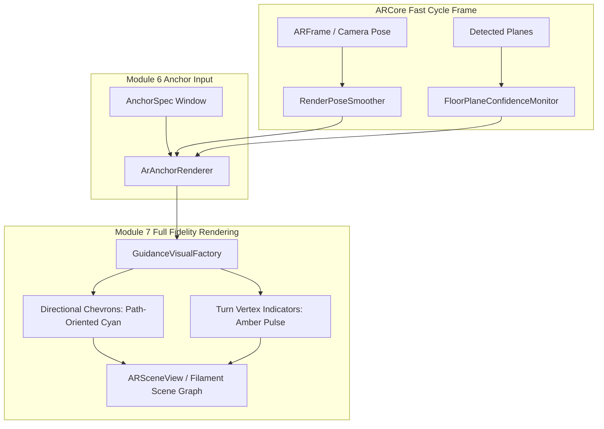

# Phase 7 Execution Plan — Rendering Layer: Full Fidelity

**Document ID:** `Phase_7_Execution_Plan.md`  
**Phase:** Phase 7 (Roadmap §7, Module 7 Complete)  
**Status:** Plan Formulated — Awaiting User Approval  
**Target Hardware:** Samsung Galaxy S22 Ultra (`SM-S908E`, Android 13)  
**Author:** Antigravity (Gemini Coding Assistant)  
**Date:** 2026-08-27  

---

## 1. Objective & Architectural Purpose

Phase 7 completes **Module 7 (Rendering Layer)** beyond the basic primitive proofs of earlier phases. It establishes the full visual fidelity of MallAR's indoor AR navigation:
1. **Full Chevron & Turn-Marker 3D Visuals:** World-locked, floor-attached, Live-View-style directional guidance chevrons aligned with corridor path headings, and distinctive amber turn-vertex indicators.
2. **Render-Level Pose-Noise Smoothing Filter:** A high-frequency micro-jitter attenuation filter operating on frame-to-frame render poses, completely distinct from Module 6's slow-cycle correction smoothing.
3. **Floor-Plane-Confidence Monitoring & Fallback:** Continuous monitoring of ARCore plane stability that seamlessly falls back to a stabilized reference elevation under challenging optical conditions (e.g. reflective mall marble, featureless tiles, or glare) to guarantee zero vertical jitter.

---

## 2. Scope & Boundaries

### In Scope (Phase 7 Deliverables):
- `RenderPoseSmoother`: High-frequency pose filter (adaptive One-Euro / EMA filter) to eliminate micro-jitter without adding latency.
- `FloorPlaneConfidenceMonitor`: Real-time tracking quality and plane extent evaluator with graceful fixed-height stabilization fallback.
- `GuidanceVisualFactory`: 3D directional chevron arrows, path heading orientation, turn markers, and Filament material shading.
- Integration into `ArAnchorRenderer` and `ArSceneViewWrapper`.
- Comprehensive unit tests in `app/src/test/java/com/example/mallar/ar/render/`.

### Explicit Exclusions (Deferred to Phase 8 / Phase 9):
- **Transition Mode Visuals:** Floor-change elevator/stairs simplified state (triggered by Module 8 in Phase 8).
- **Arrival Visual State:** Destination proximity arrival indicator (triggered by Module 8 in Phase 8).
- **Drift/Deviation Rebuild Decisions:** Handled by Module 8 supervisor in Phase 8.
- **Legacy Overlay Deletion:** Deferred to Phase 9 hardening per Roadmap §9.

---

## 3. Detailed Component Architecture

---

### 3.1 `RenderPoseSmoother` (Pose-Noise Attenuation)
- **Problem Solved:** Natural hand tremors and camera sensor noise cause minute frame-to-frame fluctuations in device pose, leading to subtle shimmering of 3D objects.
- **Mechanism:** Implements an adaptive filter (One-Euro filter algorithm) that dynamically adjusts its cutoff frequency:
  - When the device is held still, the cutoff drops, aggressively filtering out micro-jitter.
  - When the device moves or rotates rapidly, the cutoff increases, eliminating visual lag.
- **Separation of Concerns:** Does **not** alter the underlying ARCore anchor coordinates; operates purely on the render projection smoothing.

---

### 3.2 `FloorPlaneConfidenceMonitor` (Surface Stability & Fallback)
- **Problem Solved:** Highly reflective mall flooring (polished marble, specular highlights) can cause ARCore plane estimates to momentarily fluctuate or lose tracking.
- **Mechanism:**
  - Evaluates plane tracking status, polygon extent, and observation age.
  - When confidence is high: Snaps anchor elevation directly to $Y_{\text{plane}}$.
  - When confidence degrades (unstable plane / loss of plane): Smoothly bridges elevation using a stabilized rolling-average floor height with exponential damping, preventing vertical popping or sinking.

---

### 3.3 High-Fidelity 3D Guidance Visuals (`GuidanceVisualFactory`)
- **Directional Chevrons:**
  - Forward-pointing 3D chevron/arrow geometry rotated around the Y-axis to match the tangent heading of the route corridor segment:
    $$\theta_{\text{segment}} = \operatorname{atan2}(X_{i+1} - X_i, Z_{i+1} - Z_i)$$
  - Styled with high-contrast Cyan (`#00BCD4`) and clean Filament material properties.
- **Turn Vertex Markers:**
  - Distinctive Amber (`#FFB300`) markers at corners ($\ge 120^\circ$) with elevated height and distinct geometric footprint.
- **Fade Transitions:**
  - Frame-driven alpha ramp ($8\text{ frames}$) for seamless sliding-window ingress and egress.

---

## 4. Proposed File Changes

| Component / File | Action | Purpose |
|---|---|---|
| `app/src/main/java/com/example/mallar/ar/render/RenderPoseSmoother.kt` | **[NEW]** | Implements adaptive pose-noise filter for high-frequency jitter reduction. |
| `app/src/main/java/com/example/mallar/ar/render/FloorPlaneConfidenceMonitor.kt` | **[NEW]** | Evaluates plane stability and provides fixed-height fallback under reflective conditions. |
| `app/src/main/java/com/example/mallar/ar/render/GuidanceVisualFactory.kt` | **[NEW]** | Generates path-oriented 3D chevrons, turn indicators, and Filament materials. |
| `app/src/main/java/com/example/mallar/ar/ArAnchorRenderer.kt` | **[MODIFY]** | Integrates smoothing filter, plane confidence fallback, and chevron visuals. |
| `app/src/test/java/com/example/mallar/ar/render/RenderPoseSmootherTest.kt` | **[NEW]** | Unit tests for variance reduction, static noise filtering, and dynamic response. |
| `app/src/test/java/com/example/mallar/ar/render/FloorPlaneConfidenceMonitorTest.kt` | **[NEW]** | Unit tests for plane confidence evaluation and fallback transitions. |

---

## 5. Verification & Testing Plan

### 5.1 Automated Unit Tests
- `RenderPoseSmootherTest`: Verify measurable variance reduction on noisy synthetic trajectories without phase lag.
- `FloorPlaneConfidenceMonitorTest`: Verify graceful transition to fixed-height fallback when plane confidence drops.
- Command: `./gradlew.bat :app:testDebugUnitTest --console=plain`

### 5.2 Build Verification
- Command: `./gradlew.bat :app:assembleDebug --console=plain`

### 5.3 On-Device Validation Protocol (Samsung Galaxy S22 Ultra)
1. **Normal Floor Condition:** Walk through an indoor corridor. Confirm directional chevrons point along the hallway and turn markers highlight corners.
2. **Pose Smoothing Test:** Hold device stationary. Confirm zero micro-shimmering or jitter on rendered chevrons.
3. **Destabilized Floor Test (Reflective Surface):** Point camera at a highly reflective or featureless surface. Confirm markers maintain stable elevation without vertical bouncing.

---

## 6. Sign-Off & Rollback Strategy

- **Rollback:** If rendering fidelity introduces regression, changes are strictly isolated to `com.example.mallar.ar.render` and `ArAnchorRenderer.kt`, allowing instantaneous reversion to Phase 6 baseline.
- **Exit Criteria:** All automated unit tests pass; hardware validation confirms variance reduction and floor-plane fallback stability on the Galaxy S22 Ultra.
