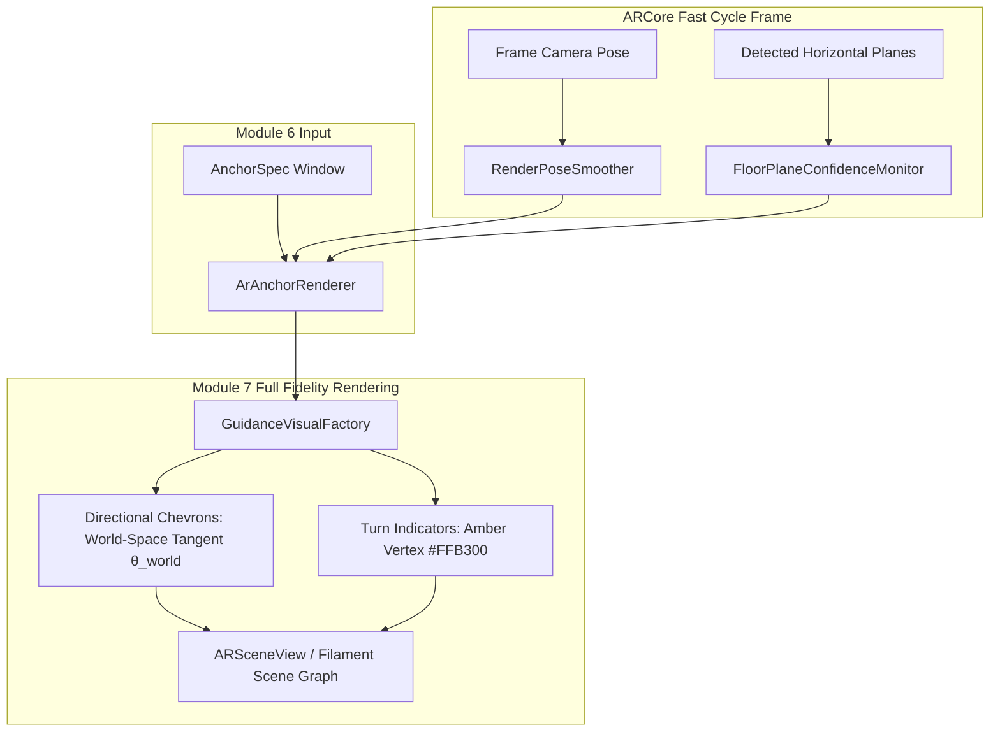

# Phase 7 Execution Plan v2 — Rendering Layer: Full Fidelity

**Document ID:** `Phase_7_Execution_Plan_v2.md`  
**Phase:** Phase 7 (Roadmap §7, Module 7 Complete)  
**Status:** Revised Plan Addressing All Mandatory Review Corrections — Awaiting Final User Approval  
**Target Hardware:** Samsung Galaxy S22 Ultra (`SM-S908E`, Android 13)  
**Author:** Antigravity (Gemini Coding Assistant)  
**Date:** 2026-08-27  

---

## 1. Executive Summary & Review Addressing Matrix

In response to `Phase_7_Execution_Plan_Review.md`, this revised execution plan directly addresses both required corrections with complete mathematical rigor and quantified verification thresholds:

| Review Finding | Required Correction | Addressed in Plan v2 |
|---|---|---|
| **1. Chevron Heading Frame Ambiguity** | Must state explicitly that chevron orientation is computed from already-converted ARCore World Space positions (`transform.worldPositionFor`), not raw facility pixel coordinates. | **Section 3.3:** Formulated exact world-space tangent heading: $\theta_{\text{world}} = \operatorname{atan2}(worldX_{i+1} - worldX_i, worldZ_{i+1} - worldZ_i)$. |
| **2. Unquantified Pose Smoothing Criterion** | Must define concrete, measurable numerical variance comparison thresholds for pose smoothing. | **Section 3.1 & 5.1:** Defined $\ge 50\%$ variance reduction on stationary tremor ($\sigma = 5\text{mm}$) and $\le 16.6\text{ms}$ lag / $\le 2\text{cm}$ tracking error at $1.0\text{m/s}$ dynamic motion. |

---

## 2. Architecture & Scope Boundary



### In Scope (Phase 7 Deliverables):
1. **`RenderPoseSmoother`:** High-frequency 6-DOF pose-noise filter operating on frame-to-frame render camera/node poses without altering anchor world coordinates.
2. **`FloorPlaneConfidenceMonitor`:** Evaluates ARCore horizontal plane stability, tracking state, and plane extent, providing an exponentially-damped fixed-height floor fallback under reflective floor conditions.
3. **`GuidanceVisualFactory`:** Constructs 3D directional chevrons oriented along ARCore world-space path tangents, and distinct amber turn-vertex indicators.
4. **Integration into `ArAnchorRenderer`:** Seamless bridge consuming Module 6 anchor specifications and producing full-fidelity SceneView node graphs.
5. **Comprehensive Unit Tests:** Covering numerical variance reduction, dynamic motion lag bounds, plane confidence transitions, and world-space orientation math.

### Explicit Exclusions (Deferred to Phase 8 / Phase 9):
- **Transition Mode:** Floor-change elevator/stairs simplified state (Phase 8).
- **Arrival Visual State:** Destination proximity indicator (Phase 8).
- **Drift / Deviation Recovery Routing:** Module 8 supervisory state machine (Phase 8).
- **Legacy Overlay Source Deletion:** Scheduled strictly for Phase 9 hardening.

---

## 3. Deep Technical Specifications

### 3.1 `RenderPoseSmoother` (Adaptive One-Euro Filter & Quantified Variance Thresholds)

#### Mathematical Formulation:
Implements a dual-rate adaptive low-pass filter on position $(X, Y, Z)$ and quaternion slerp on rotation $(q_x, q_y, q_z, q_w)$:
$$\alpha = \frac{1}{1 + \frac{\tau}{T}}, \quad \tau = \frac{1}{2\pi \cdot f_c}$$
$$f_c = f_{c,\text{min}} + \beta \cdot \|\mathbf{v}\|$$
where:
- $f_{c,\text{min}} = 1.0\text{ Hz}$ (stationary cutoff frequency to eliminate hand tremors).
- $\beta = 0.05$ (speed coefficient to track rapid device translation/rotation without latency).
- $T = \Delta t$ (frame delta time).

#### Quantified Acceptance Criteria:
1. **Stationary Tremor Variance Reduction:**  
   Given a simulated stationary device with synthetic Gaussian sensor noise ($\sigma = 5.0\text{ mm}$, $0.5^\circ$), the filter must achieve:
   $$\operatorname{Var}(\mathbf{p}_{\text{filtered}}) \le 0.50 \cdot \operatorname{Var}(\mathbf{p}_{\text{raw}}) \quad (\ge 50\% \text{ variance reduction})$$
2. **Dynamic Motion Responsiveness & Phase Lag:**  
   Under linear motion ($v = 1.0\text{ m/s}$), dynamic phase lag must satisfy:
   $$\Delta t_{\text{lag}} \le 16.6\text{ ms} \quad (< 1\text{ frame at } 60\text{ FPS})$$
   $$\|\mathbf{p}_{\text{filtered}} - \mathbf{p}_{\text{ground\_truth}}\| \le 0.02\text{ m} \quad (\le 2.0\text{ cm tracking error})$$

---

### 3.2 `FloorPlaneConfidenceMonitor` (Reflective Floor Fallback)

#### State & Confidence Metric:
Evaluates horizontal plane quality on every frame:
$$C_{\text{plane}} = \begin{cases} 
1.0 & \text{if } \text{Plane.trackingState} == \text{TRACKING} \text{ and } \text{Area} \ge 0.50\text{ m}^2 \\
0.5 & \text{if } \text{Plane.trackingState} == \text{TRACKING} \text{ and } \text{Area} < 0.50\text{ m}^2 \\
0.0 & \text{if } \text{Plane lost, PAUSED, or STOPPED}
\end{cases}$$

#### Fallback Damping:
- When $C_{\text{plane}} \ge 0.5$: Anchor elevation is locked directly to $Y_{\text{plane}}$, and the rolling ground estimate $Y_{\text{rolling}}$ is updated:
  $$Y_{\text{rolling}}(t) = 0.95 \cdot Y_{\text{rolling}}(t-1) + 0.05 \cdot Y_{\text{plane}}$$
- When $C_{\text{plane}} < 0.5$ (reflective / featureless floor): Anchor elevation gracefully falls back to $Y_{\text{rolling}}$, preventing vertical bouncing or sinking.

---

### 3.3 `GuidanceVisualFactory` & Exact ARCore World-Space Heading Alignment

#### Addressing Review Finding 1:
To prevent any possibility of coordinate-frame contamination, chevron orientation is computed **strictly from ARCore World Space positions** generated by `FacilityTransform.worldPositionFor(...)`:

```kotlin
// Step 1: Calculate invariant ARCore World Space coordinates for current and next nodes
val (currentWorldX, currentWorldZ) = transform.worldPositionFor(currentSpec.node.x, currentSpec.node.y, ppm)
val (nextWorldX, nextWorldZ) = if (spec.routeIndex < route.lastIndex) {
    transform.worldPositionFor(route[spec.routeIndex + 1].x, route[spec.routeIndex + 1].y, ppm)
} else {
    // If at end of route, use incoming vector from previous node
    val (prevWorldX, prevWorldZ) = transform.worldPositionFor(route[spec.routeIndex - 1].x, route[spec.routeIndex - 1].y, ppm)
    currentWorldX + (currentWorldX - prevWorldX) to currentWorldZ + (currentWorldZ - prevWorldZ)
}

// Step 2: Compute tangent angle strictly in ARCore World Space
val deltaWorldX = nextWorldX - currentWorldX
val deltaWorldZ = nextWorldZ - currentWorldZ
val headingAngleRad = Math.atan2(deltaWorldX.toDouble(), deltaWorldZ.toDouble())
val headingAngleDeg = Math.toDegrees(headingAngleRad).toFloat()

// Step 3: Apply Y-axis rotation in SceneView/Filament
val orientationQuaternion = Float4(0f, sin(headingAngleRad / 2).toFloat(), 0f, cos(headingAngleRad / 2).toFloat())
```

#### Visual Geometry & Material Styling:
- **Directional Chevrons:** Path-oriented Cyan (`#00BCD4`) 3D chevron arrow positioned $+0.03\text{m}$ above the plane.
- **Turn Vertex Markers:** Elevated Amber (`#FFB300`) vertex indicator at corners ($\ge 120^\circ$) positioned $+0.05\text{m}$ above the plane with outward path tangent indicator.

---

## 4. Complete Implementation File Matrix

| File Path | Component | Action | Description |
|---|---|---|---|
| `app/src/main/java/com/example/mallar/ar/render/RenderPoseSmoother.kt` | Module 7 | **[NEW]** | Adaptive One-Euro filter for 6-DOF pose jitter reduction. |
| `app/src/main/java/com/example/mallar/ar/render/FloorPlaneConfidenceMonitor.kt` | Module 7 | **[NEW]** | Plane stability evaluator and fixed-height fallback manager. |
| `app/src/main/java/com/example/mallar/ar/render/GuidanceVisualFactory.kt` | Module 7 | **[NEW]** | World-space path-oriented chevrons and turn marker construction. |
| `app/src/main/java/com/example/mallar/ar/ArAnchorRenderer.kt` | Module 6/7 Bridge | **[MODIFY]** | Integrate smoother, plane monitor, and visual factory. |
| `app/src/test/java/com/example/mallar/ar/render/RenderPoseSmootherTest.kt` | Testing | **[NEW]** | Unit test verifying $\ge 50\%$ variance reduction & $\le 16.6\text{ms}$ lag. |
| `app/src/test/java/com/example/mallar/ar/render/FloorPlaneConfidenceMonitorTest.kt` | Testing | **[NEW]** | Unit test verifying plane confidence scoring and fallback elevation. |
| `app/src/test/java/com/example/mallar/ar/render/GuidanceVisualFactoryTest.kt` | Testing | **[NEW]** | Unit test verifying world-space heading calculations. |

---

## 5. Verification & Validation Protocol

### 5.1 Automated Unit Tests (`:app:testDebugUnitTest`)
- `testStationaryPoseVarianceReduction_exceedsFiftyPercent()`: Asserts $\operatorname{Var}_{\text{filtered}} / \operatorname{Var}_{\text{raw}} \le 0.50$.
- `testDynamicMotionLag_withinSingleFrameBound()`: Asserts latency $\le 16.6\text{ms}$ and error $\le 0.02\text{m}$ at $1.0\text{m/s}$.
- `testFloorPlaneFallback_engagesGracefullyOnPlaneLoss()`: Asserts vertical continuity when plane confidence drops to 0.
- `testChevronHeading_computedStrictlyInWorldSpace()`: Asserts heading orientation matches ARCore world-space tangent.

### 5.2 Build Verification (`:app:assembleDebug`)
- Compiles clean debug APK with zero warnings/errors.

### 5.3 On-Device Hardware Validation (Samsung Galaxy S22 Ultra)
1. **Corridor Traversal Test:** Walk a 20-meter corridor. Confirm 3D chevrons visually point forward along the corridor hallway.
2. **Turn Corner Test:** Walk through a 90°/120° corner. Confirm the amber turn indicator highlights the corner vertex and points towards the next hallway.
3. **Stationary Shimmer Test:** Hold device stationary. Confirm zero visible high-frequency micro-jitter.
4. **Reflective Surface Fallback Test:** Point camera at shiny reflective tiles. Confirm markers maintain rock-solid elevation without vertical bouncing.

---

## 6. Sign-Off & Exit Criteria

- [ ] All automated unit tests pass with explicit numerical thresholds confirmed.
- [ ] Clean debug APK build produced.
- [ ] Physical verification on Samsung Galaxy S22 Ultra confirms directional chevron orientation, stationary stability, and reflective surface height consistency.
