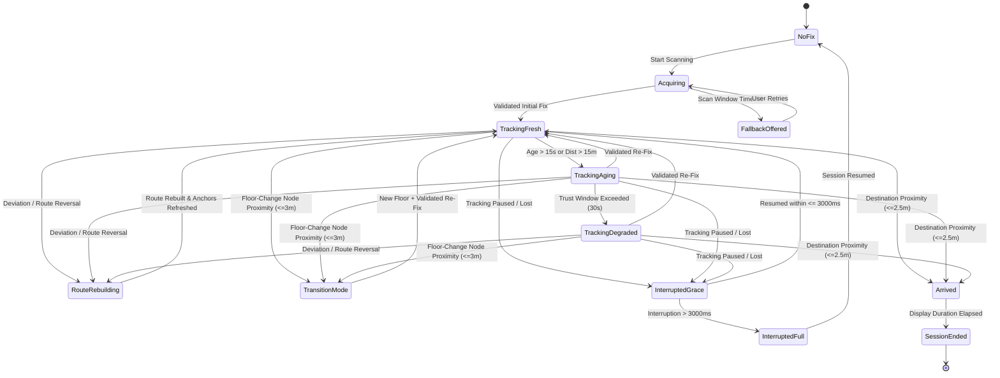

# Phase 8 Execution Plan: Drift & Recovery Layer + State Machine Supervision

**Document:** `docs/AR/Implementation/Phases/Phase 8/Phase_8_Execution_Plan.md`  
**Phase:** Phase 8 (Roadmap §8, Module 8 Complete)  
**Status:** In Planning — Awaiting User Approval  
**Target Hardware:** Samsung Galaxy S22 Ultra (`SM-S908E`, Android 13)

---

## 1. Goal Description

Phase 8 implements the complete **Module 8 (Drift & Recovery Layer)** and completes the end-to-end runtime supervision of the MallAR AR navigation subsystem. As the supervisory layer, Module 8 owns no primary tracking or transform state, but reads state across Modules 2, 3, 4, 5, and 6 to classify tracking quality and navigation correctness, issuing instructions to subordinate modules.

### Core Objectives:
1. **Full Runtime State Machine (Engineering Spec §7):**
   - Implements all 12 defined runtime states: `No Fix`, `Acquiring`, `Tracking: Fresh`, `Tracking: Aging`, `Tracking: Degraded`, `Route Rebuilding`, `Transition Mode`, `Interrupted: Grace`, `Interrupted: Full`, `Fallback Offered`, `Arrived`, `Session Ended`.
2. **Drift vs. Deviation Classification (Addressing Phase 7 Review Mandate):**
   - **Drift (Within Bounds):** Lateral divergence $\le 2.5\text{m}$ along the planned path $\implies$ instructs Module 6 to apply smooth interpolated correction without rebuilding the route.
   - **Deviation (Off-Path / Graph Edge Cross):** Lateral divergence $> 2.5\text{m}$ or crossing graph edges $\implies$ instructs Module 5 to recalculate the route and Module 6 to rebuild the active anchor window.
   - **Route-Reversal Detection (Mandated in Phase 7 Acceptance):** Detects when a user turns $180^\circ$ and walks backward against the forward-directed route. Explicitly triggers a clean **Route Rebuild** from the user's current location rather than permitting the sliding window to abruptly re-instantiate old start anchors.
3. **Interruption Grace-Window Policy (~3000ms):**
   - Tracking interruptions (e.g. camera occlusion or rapid panning) resolved within $\le 3000\text{ms}$ return to the prior tracking state with zero fresh-fix requirement.
   - Interruptions $> 3000\text{ms}$ transition to `Interrupted: Full` $\rightarrow$ `No Fix` requiring a mandatory fresh fix on resume.
4. **Transition Mode (Multi-Floor Handling):**
   - Proximity $\le 3.0\text{m}$ to a floor-change node (stairs, elevator, escalator) triggers `Transition Mode`.
   - Pauses anchor rendering while keeping the ARCore session running; observes barometer relative altitude changes; upon reaching the new floor, requires a mandatory validated re-fix before returning to `Tracking: Fresh`.
5. **Destination Arrival Integration:**
   - Proximity $\le 2.5\text{m}$ to destination node triggers `Arrived`.
   - Replaces directional chevrons with a distinct 3D Arrival Beacon/Pin (Emerald Green `#4CAF50`), displays arrival banner, and terminates cleanly into `Session Ended` after a brief display duration.
6. **Legacy `DriftMonitor` Callback Disablement:**
   - Ensures `DriftMonitor.onRelocalizationNeeded` is silenced during active AR navigation so Module 8 is the sole authoritative decision-maker.

---

## 2. Architecture & State Machine Flow



---

## 3. User Review Required & Design Decisions

> [!IMPORTANT]
> **1. Route-Reversal Trigger Thresholds:**
> Route reversal is classified when:
> - User's movement vector forms an angle $\ge 120^\circ$ relative to the forward corridor segment tangent, **OR**
> - The distance to the next upcoming route node increases consecutively over 3 evaluation windows ($> 1.5\text{m}$ backward motion).
> This immediately triggers `Route Rebuilding` via `AStarPath` from the user's nearest graph node to the destination, ensuring chevrons smoothly re-orient without "shattering" starting anchors.

> [!NOTE]
> **2. Single-Decision Ownership:**
> In accordance with Engineering Specification §6.4, `DriftMonitor.onRelocalizationNeeded` is intercepted/silenced during active AR navigation. Module 8 evaluates raw `DriftMonitor.driftState` measurements and directly controls when re-fix requests, corrections, or rebuilds occur.

---

## 4. Proposed Changes

### Component 1: `com.example.mallar.ar.supervision` (New Supervisory Subsystem)

#### [NEW] `DriftRecoverySupervisor.kt`
- Implements the complete runtime state machine and supervisory logic:
```kotlin
package com.example.mallar.ar.supervision

import com.example.mallar.ar.FacilityTransform
import com.example.mallar.ar.LocalTrackingPose
import com.example.mallar.ar.model.RouteNodeMetadata
import com.example.mallar.navigation.DriftMonitor
import com.google.ar.core.TrackingFailureReason
import com.google.ar.core.TrackingState
import kotlin.math.*

enum class ArRuntimeState {
    NO_FIX,
    ACQUIRING,
    TRACKING_FRESH,
    TRACKING_AGING,
    TRACKING_DEGRADED,
    ROUTE_REBUILDING,
    TRANSITION_MODE,
    INTERRUPTED_GRACE,
    INTERRUPTED_FULL,
    FALLBACK_OFFERED,
    ARRIVED,
    SESSION_ENDED
}

enum class DivergenceClassification {
    ON_TRACK,
    DRIFT,
    DEVIATION
}

enum class EnvironmentalGuidance {
    NONE,
    INSUFFICIENT_LIGHT,
    EXCESSIVE_MOTION,
    POINT_AT_SURROUNDINGS,
    MANUAL_RESCAN_SUGGESTED
}

sealed class SupervisoryInstruction {
    object None : SupervisoryInstruction()
    data class ApplyDriftCorrection(val lateralOffsetPx: Double) : SupervisoryInstruction()
    data class RebuildRoute(val currentFacilityX: Double, val currentFacilityY: Double) : SupervisoryInstruction()
    data class EnterTransitionMode(val targetFloor: Int) : SupervisoryInstruction()
    object ExitTransitionMode : SupervisoryInstruction()
    data class EnterArrivedState(val destinationNode: RouteNodeMetadata) : SupervisoryInstruction()
    object RequestReFix : SupervisoryInstruction()
}

class DriftRecoverySupervisor(
    private val lateralDriftThresholdMeters: Double = 2.5,
    private val freshDurationMs: Long = 15_000L,
    private val trustWindowMs: Long = 30_000L,
    private val graceWindowMs: Long = 3_000L,
    private val arrivalRadiusMeters: Double = 2.5,
    private val floorTransitionRadiusMeters: Double = 3.0,
    private val pixelsPerMeter: Double = 20.0
) {
    var state: ArRuntimeState = ArRuntimeState.NO_FIX
        private set
    
    var environmentalGuidance: EnvironmentalGuidance = EnvironmentalGuidance.NONE
        private set

    private var stateEnteredAtMs: Long = 0L
    private var lastValidFixAtMs: Long = 0L
    private var interruptedAtMs: Long = 0L
    private var stateBeforeInterruption: ArRuntimeState = ArRuntimeState.TRACKING_FRESH
    private var consecutiveRejectionCount: Int = 0
    private var reverseWalkCount: Int = 0
    private var lastDistanceToNextNode: Double = Double.MAX_VALUE

    fun evaluate(
        timestampMs: Long,
        trackingState: TrackingState,
        trackingFailureReason: TrackingFailureReason,
        transform: FacilityTransform?,
        localPose: LocalTrackingPose,
        route: List<RouteNodeMetadata>,
        driftState: DriftMonitor.DriftState,
        isBarometerTransitionConfirmed: Boolean = false
    ): SupervisoryInstruction
}
```

---

### Component 2: `com.example.mallar.ar` (Module 5, 6 & 7 Integrations)

#### [MODIFY] `RoutePathLayer.kt`
- Adds `recalculateFromFacilityPosition(facilityX: Double, facilityY: Double, floor: Int)` to find the closest graph node and recompute the A* path to destination.

#### [MODIFY] `ArAnchorRenderer.kt`
- Adds state-driven rendering control:
  - `setTransitionMode(enabled: Boolean)`: Pauses chevron instantiation/rendering during floor changes.
  - `setArrivedState(isArrived: Boolean, destinationNode: RouteNodeMetadata)`: Instantiates the prominent 3D Green Arrival Beacon.
  - `setTrackingDegraded(degraded: Boolean)`: Applies subdued alpha/pulse to chevrons during degraded state.

#### [MODIFY] `GuidanceVisualFactory.kt`
- Implements 3D Arrival Beacon node (Green `#4CAF50` elevated pillar with animated pulse).
- Implements Transition Mode directional floor prompt.

---

### Component 3: `com.example.mallar.ar.ui` & Navigation Integration

#### [MODIFY] `ArSceneViewWrapper.kt`
- Integrates `DriftRecoverySupervisor` in the per-frame ARCore update loop.
- Silences `DriftMonitor.onRelocalizationNeeded` during active session.
- Exposes `supervisorState` and `environmentalGuidance` to Compose HUD.

#### [MODIFY] `UnifiedNavigationScreen.kt`
- Renders contextual banner overlay when `environmentalGuidance` is active (e.g. "Low light detected", "Keep phone pointed forward", "Approaching elevator").

---

## 5. Verification Plan

### Automated Unit Tests
We will add exhaustive unit tests covering all states, transitions, and edge cases in:
📁 `app/src/test/java/com/example/mallar/ar/supervision/DriftRecoverySupervisorTest.kt`

1. **State Machine Coverage Test:**
   - Exercises all 12 states and 100% of defined transitions.
2. **Drift vs. Deviation Distinction Test:**
   - Lateral offset $= 1.2\text{m} \implies$ `ApplyDriftCorrection` (No rebuild).
   - Lateral offset $= 3.5\text{m} \implies$ `RebuildRoute`.
3. **Route-Reversal Detection Test:**
   - Simulates walking backward against route direction $\implies$ Triggers `RebuildRoute`.
4. **Interruption Grace-Window Test:**
   - Tracking lost for $1500\text{ms} \rightarrow$ Resumes to `Tracking: Fresh` without fresh fix.
   - Tracking lost for $3500\text{ms} \rightarrow$ Transitions to `Interrupted: Full` $\rightarrow$ `No Fix`.
5. **Transition Mode & Arrival Test:**
   - Proximity to floor-change node $\le 3\text{m} \implies$ `EnterTransitionMode`.
   - Proximity to destination $\le 2.5\text{m} \implies$ `EnterArrivedState`.

### Manual On-Device Verification (Samsung Galaxy S22 Ultra)
1. **Route Reversal Test:** Walk 10m forward, turn 180° and walk back. Confirm chevrons immediately recalculate and point toward destination without anchor shattering.
2. **Grace-Window Occlusion Test:** Cover camera lens for 1.5s, uncover. Confirm tracking seamlessly resumes. Cover for 4.0s, uncover. Confirm prompt to re-scan.
3. **Arrival Beacon Test:** Walk to within 2m of destination. Confirm large emerald green 3D beacon appears at destination.
