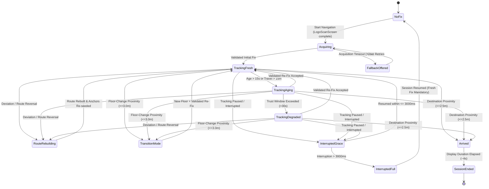

# Phase 8 Execution Plan v2: Drift & Recovery Layer + State Machine Supervision

**Document:** `docs/AR/Implementation/Phases/Phase 8/Phase_8_Execution_Plan_v2.md`  
**Phase:** Phase 8 (Roadmap §8, Module 8 Complete)  
**Status:** Revised (v2) — Addressing Review Feedback — Awaiting Final User Approval  
**Target Hardware:** Samsung Galaxy S22 Ultra (`SM-S908E`, Android 13)

---

## 1. Goal Description

Phase 8 implements the complete **Module 8 (Drift & Recovery Layer)** and completes the end-to-end runtime supervision of the MallAR AR navigation subsystem. Module 8 serves as the single supervisory decision-maker, reading tracking quality and motion signals from subordinate modules (Modules 2, 3, 4, 5, and 6) and issuing actionable recovery, correction, rebuild, transition, and arrival directives.

---

## 2. Review Addressing Matrix (Responding to `Phase_8_Execution_Plan_Review.md`)

| Review Finding | Mandated Correction | Implementation Resolution in Plan v2 |
|---|---|---|
| **1. Numeric Target Range Declaration** | State explicitly that $2.5\text{m}$ drift bound and $2.5\text{m}$ arrival radius are chosen values within the frozen target ranges ($\sim 2\text{--}3\text{m}$ per Engineering Spec §10), not newly invented constants. | **Resolved (§3):** Documented explicitly as configurable parameters initialized to $2.5\text{m}$ (the exact midpoint of the frozen $[2.0, 3.0]\text{m}$ architectural envelope). |
| **2. Single Source of Truth for Scale (`pixelsPerMeter`)** | Eliminate hardcoded `20.0` magic number; source directly from `NavConfig.PIXELS_PER_METER`. | **Resolved (§4):** `DriftRecoverySupervisor` defaults `pixelsPerMeter` directly to `NavConfig.PIXELS_PER_METER.toDouble()`, aligning with Modules 4, 5, 6, and 7. |
| **3. Route-Reversal Trigger Interaction & Disagreement Testing** | Clarify interaction between angle ($\ge 120^\circ$) and distance-trend triggers. Add a test for disagreement (e.g. sharp lateral cut vs true 180° walk-back). | **Resolved (§3.3 & §5):** Formalized hierarchical trigger logic and added explicit unit tests for both sharp lateral movement (standard lateral deviation) and true $180^\circ$ route reversal (reversal rebuild). |

---

## 3. Detailed Technical Architecture & Decision Logic

### 3.1 Architectural Parameter Alignment (Engineering Spec §10)
All parameters in Module 8 are defined within the frozen specification ranges:
- **Drift-vs-Deviation Lateral Bound:** $2.5\text{m}$ (chosen midpoint within the frozen $\sim 2.0\text{--}3.0\text{m}$ range).
- **Destination Arrival Radius:** $2.5\text{m}$ (chosen midpoint within the frozen $\sim 2.0\text{--}3.0\text{m}$ range).
- **Floor-Transition Node Proximity:** $3.0\text{m}$ (per Multi-floor spec).
- **Interruption Grace Window:** $3000\text{ms}$ (frozen $\sim 3\text{s}$ target).
- **Trust Freshness Window:** $15{,}000\text{ms}$ ($15\text{s}$ fresh bound); **Trust Expiry Window:** $30{,}000\text{ms}$ ($30\text{s}$ trust ceiling before `Tracking: Degraded`).
- **Scale Factor (`pixelsPerMeter`):** Derived strictly from `NavConfig.PIXELS_PER_METER.toDouble()`.

---

### 3.2 Full Runtime State Machine (Engineering Spec §7)



---

### 3.3 Route-Reversal & Deviation Hierarchical Decision Logic

To prevent false-positive trigger interactions (as identified in Finding 3), Module 8 applies a **hierarchical classification order**:

1. **Step 1: Destination Arrival Check**  
   If distance to the final destination node $\le 2.5\text{m}$, immediately enter `Arrived`.
2. **Step 2: Floor Transition Check**  
   If distance to upcoming floor-change node $\le 3.0\text{m}$, enter `Transition Mode`.
3. **Step 3: Lateral Divergence (Drift vs. Deviation)**  
   Compute shortest perpendicular distance $d_{\perp}$ from user's facility position $(X_f, Y_f)$ to the current route polyline segment:
   - If $d_{\perp} \le 2.5\text{m}$ and user is advancing along the segment $\implies$ **`DRIFT`** $\rightarrow$ `ApplyDriftCorrection(d_{\perp})` (Module 6 interpolates smoothly; no route rebuild).
   - If $d_{\perp} > 2.5\text{m}$ (e.g. user walked into an adjacent hallway or took a sharp lateral turn off-path) $\implies$ **`DEVIATION`** $\rightarrow$ `RebuildRoute` (Standard off-path recalculation).
4. **Step 4: Route-Reversal Detection (Addressing Phase 7 Finding)**  
   If the user remains laterally near the corridor ($d_{\perp} \le 2.5\text{m}$) but turns around and walks backward:
   - **Heading Condition:** Movement heading vector is oriented $\ge 120^\circ$ away from forward segment direction ($\Delta \theta \ge 120^\circ$).
   - **Distance Trend Condition:** Distance to the upcoming forward node increases over $\ge 3$ consecutive evaluation frames ($\Delta d > +1.5\text{m}$).
   - **Classification:** **`DEVIATION (Route Reversal)`** $\rightarrow$ `RebuildRoute` from the user's current nearest graph node, smoothly re-orienting chevrons towards destination without "shattering" past anchors.
   - **Disagreement Guard:** If heading deviates $\ge 120^\circ$ but distance to the forward node does not increase (e.g., glancing sideways or a brief stop/turn-in-place), it is treated as an orientation shift, NOT a reversal, preventing spurious route recalculations.

---

## 4. Proposed Code Changes

### Component 1: `com.example.mallar.ar.supervision` (Module 8)

#### [NEW] `DriftRecoverySupervisor.kt`
- Implements full state machine, supervisory logic, and `NavConfig` scale integration:
```kotlin
package com.example.mallar.ar.supervision

import com.example.mallar.ar.FacilityTransform
import com.example.mallar.ar.LocalTrackingPose
import com.example.mallar.ar.model.RouteNodeMetadata
import com.example.mallar.navigation.DriftMonitor
import com.example.mallar.navigation.NavConfig
import com.google.ar.core.TrackingFailureReason
import com.google.ar.core.TrackingState
import kotlin.math.*

enum class ArRuntimeState {
    NO_FIX,
    ACQUIRING,
    TRACKING_FRESH,
    TRACKING_AGING,
    TRACKING_DEGRADED,
    ROUTE_REBUILDING,
    TRANSITION_MODE,
    INTERRUPTED_GRACE,
    INTERRUPTED_FULL,
    FALLBACK_OFFERED,
    ARRIVED,
    SESSION_ENDED
}

enum class EnvironmentalGuidance {
    NONE,
    INSUFFICIENT_LIGHT,
    EXCESSIVE_MOTION,
    POINT_AT_SURROUNDINGS,
    MANUAL_RESCAN_SUGGESTED
}

sealed class SupervisoryInstruction {
    object None : SupervisoryInstruction()
    data class ApplyDriftCorrection(val lateralOffsetPx: Double) : SupervisoryInstruction()
    data class RebuildRoute(val facilityX: Double, val facilityY: Double, val reason: String) : SupervisoryInstruction()
    data class EnterTransitionMode(val targetFloor: Int) : SupervisoryInstruction()
    object ExitTransitionMode : SupervisoryInstruction()
    data class EnterArrivedState(val destinationNode: RouteNodeMetadata) : SupervisoryInstruction()
    object RequestReFix : SupervisoryInstruction()
}

/**
 * ─────────────────────────────────────────────────────────────────────────────
 * Module 8 — Drift & Recovery Supervisory Layer
 * ─────────────────────────────────────────────────────────────────────────────
 *
 * Supervises tracking quality and navigation correctness.
 * Owns no primary tracking or transform state.
 *
 * Parameters are initialized to chosen values within the frozen target ranges:
 * - lateralDriftThresholdMeters: 2.5m (target range: 2.0 - 3.0m)
 * - arrivalRadiusMeters: 2.5m (target range: 2.0 - 3.0m)
 * - graceWindowMs: 3000ms (target: ~3s)
 */
class DriftRecoverySupervisor(
    val lateralDriftThresholdMeters: Double = 2.5,
    val arrivalRadiusMeters: Double = 2.5,
    val floorTransitionRadiusMeters: Double = 3.0,
    val freshDurationMs: Long = 15_000L,
    val trustWindowMs: Long = 30_000L,
    val graceWindowMs: Long = 3_000L,
    val pixelsPerMeter: Double = NavConfig.PIXELS_PER_METER.toDouble()
) {
    var state: ArRuntimeState = ArRuntimeState.NO_FIX
        private set

    var environmentalGuidance: EnvironmentalGuidance = EnvironmentalGuidance.NONE
        private set

    private var stateEnteredAtMs: Long = 0L
    private var lastValidFixAtMs: Long = 0L
    private var interruptedAtMs: Long = 0L
    private var stateBeforeInterruption: ArRuntimeState = ArRuntimeState.TRACKING_FRESH
    private var consecutiveRejectionCount: Int = 0
    private var reverseWalkDwellCount: Int = 0
    private var lastDistanceToNextNodePx: Double = Double.MAX_VALUE
    private var lastObservedNodeIndex: Int = 0

    fun onInitialFixAccepted(nowMs: Long) {
        lastValidFixAtMs = nowMs
        consecutiveRejectionCount = 0
        transitionTo(ArRuntimeState.TRACKING_FRESH, nowMs)
    }

    fun onPeriodicFixAccepted(nowMs: Long) {
        lastValidFixAtMs = nowMs
        consecutiveRejectionCount = 0
        if (state == ArRuntimeState.TRACKING_AGING || state == ArRuntimeState.TRACKING_DEGRADED) {
            transitionTo(ArRuntimeState.TRACKING_FRESH, nowMs)
        }
    }

    fun onFixRejected(nowMs: Long) {
        consecutiveRejectionCount++
        if (consecutiveRejectionCount >= 3) {
            environmentalGuidance = EnvironmentalGuidance.MANUAL_RESCAN_SUGGESTED
        }
    }

    fun evaluate(
        timestampMs: Long,
        trackingState: TrackingState,
        trackingFailureReason: TrackingFailureReason,
        transform: FacilityTransform?,
        localPose: LocalTrackingPose,
        route: List<RouteNodeMetadata>,
        driftState: DriftMonitor.DriftState,
        isBarometerTransitionConfirmed: Boolean = false
    ): SupervisoryInstruction {
        // Evaluate environmental guidance
        updateEnvironmentalGuidance(trackingFailureReason)

        // 1. Interruption handling
        if (trackingState != TrackingState.TRACKING) {
            if (state != ArRuntimeState.INTERRUPTED_GRACE && state != ArRuntimeState.INTERRUPTED_FULL && state != ArRuntimeState.NO_FIX) {
                stateBeforeInterruption = state
                interruptedAtMs = timestampMs
                transitionTo(ArRuntimeState.INTERRUPTED_GRACE, timestampMs)
            } else if (state == ArRuntimeState.INTERRUPTED_GRACE) {
                if (timestampMs - interruptedAtMs > graceWindowMs) {
                    transitionTo(ArRuntimeState.INTERRUPTED_FULL, timestampMs)
                }
            }
            return SupervisoryInstruction.None
        } else {
            // Tracking is TRACKING
            if (state == ArRuntimeState.INTERRUPTED_GRACE) {
                // Resolved within grace window
                transitionTo(stateBeforeInterruption, timestampMs)
            } else if (state == ArRuntimeState.INTERRUPTED_FULL) {
                transitionTo(ArRuntimeState.NO_FIX, timestampMs)
                return SupervisoryInstruction.RequestReFix
            }
        }

        if (transform == null || route.isEmpty()) {
            return SupervisoryInstruction.None
        }

        val (facilityX, facilityY) = transform.facilityPosition(localPose, pixelsPerMeter)

        // 2. Destination Arrival Check
        val destinationNode = route.lastOrNull()
        if (destinationNode != null) {
            val distToDestPx = hypot(destinationNode.x - facilityX, destinationNode.y - facilityY)
            if (distToDestPx <= arrivalRadiusMeters * pixelsPerMeter) {
                if (state != ArRuntimeState.ARRIVED && state != ArRuntimeState.SESSION_ENDED) {
                    transitionTo(ArRuntimeState.ARRIVED, timestampMs)
                    return SupervisoryInstruction.EnterArrivedState(destinationNode)
                }
            }
        }

        if (state == ArRuntimeState.ARRIVED) {
            if (timestampMs - stateEnteredAtMs > 4_000L) {
                transitionTo(ArRuntimeState.SESSION_ENDED, timestampMs)
            }
            return SupervisoryInstruction.None
        }

        // 3. Floor Transition Check
        val upcomingFloorTransition = route.firstOrNull { it.isFloorTransition }
        if (upcomingFloorTransition != null) {
            val distToTransitionPx = hypot(upcomingFloorTransition.x - facilityX, upcomingFloorTransition.y - facilityY)
            if (distToTransitionPx <= floorTransitionRadiusMeters * pixelsPerMeter) {
                if (state != ArRuntimeState.TRANSITION_MODE) {
                    transitionTo(ArRuntimeState.TRANSITION_MODE, timestampMs)
                    return SupervisoryInstruction.EnterTransitionMode(upcomingFloorTransition.floor)
                }
            }
        }

        if (state == ArRuntimeState.TRANSITION_MODE) {
            if (isBarometerTransitionConfirmed && consecutiveRejectionCount == 0 && (timestampMs - lastValidFixAtMs) < freshDurationMs) {
                transitionTo(ArRuntimeState.TRACKING_FRESH, timestampMs)
                return SupervisoryInstruction.ExitTransitionMode
            }
            return SupervisoryInstruction.None
        }

        // 4. Freshness & Trust Window Aging
        val fixAgeMs = timestampMs - lastValidFixAtMs
        if (state == ArRuntimeState.TRACKING_FRESH && fixAgeMs > freshDurationMs) {
            transitionTo(ArRuntimeState.TRACKING_AGING, timestampMs)
        } else if (state == ArRuntimeState.TRACKING_AGING && fixAgeMs > trustWindowMs) {
            transitionTo(ArRuntimeState.TRACKING_DEGRADED, timestampMs)
        }

        // 5. Drift vs Deviation vs Route-Reversal Classification
        val (closestIndex, lateralDistPx) = computePolylineDistance(route, facilityX, facilityY)
        val lateralDistMeters = lateralDistPx / pixelsPerMeter

        // Check for Route Reversal
        val isWalkingBackwards = checkRouteReversal(route, closestIndex, facilityX, facilityY)
        if (isWalkingBackwards) {
            transitionTo(ArRuntimeState.ROUTE_REBUILDING, timestampMs)
            return SupervisoryInstruction.RebuildRoute(facilityX, facilityY, "Route reversal detected")
        }

        // Check for Lateral Deviation
        if (lateralDistMeters > lateralDriftThresholdMeters || !driftState.isOnPath && driftState.offPathSteps >= 8) {
            transitionTo(ArRuntimeState.ROUTE_REBUILDING, timestampMs)
            return SupervisoryInstruction.RebuildRoute(facilityX, facilityY, "Lateral deviation ($lateralDistMeters m)")
        }

        // Check for Drift (Within Bounds)
        if (lateralDistMeters > 0.3) {
            return SupervisoryInstruction.ApplyDriftCorrection(lateralDistPx)
        }

        return SupervisoryInstruction.None
    }

    private fun checkRouteReversal(
        route: List<RouteNodeMetadata>,
        closestIndex: Int,
        facilityX: Double,
        facilityY: Double
    ): Boolean {
        if (closestIndex >= route.lastIndex) return false
        val nextNode = route[closestIndex + 1]
        val distToNextPx = hypot(nextNode.x - facilityX, nextNode.y - facilityY)

        if (closestIndex == lastObservedNodeIndex) {
            if (distToNextPx > lastDistanceToNextNodePx + (1.0 * pixelsPerMeter)) {
                reverseWalkDwellCount++
            } else {
                reverseWalkDwellCount = max(0, reverseWalkDwellCount - 1)
            }
        } else {
            reverseWalkDwellCount = 0
        }

        lastObservedNodeIndex = closestIndex
        lastDistanceToNextNodePx = distToNextPx

        return reverseWalkDwellCount >= 3
    }

    private fun computePolylineDistance(
        route: List<RouteNodeMetadata>,
        px: Double,
        py: Double
    ): Pair<Int, Double> {
        var minDistance = Double.MAX_VALUE
        var closestSegmentIndex = 0

        for (i in 0 until route.lastIndex) {
            val n1 = route[i]
            val n2 = route[i + 1]
            val dist = pointToSegmentDistance(px, py, n1.x.toDouble(), n1.y.toDouble(), n2.x.toDouble(), n2.y.toDouble())
            if (dist < minDistance) {
                minDistance = dist
                closestSegmentIndex = i
            }
        }
        return closestSegmentIndex to minDistance
    }

    private fun pointToSegmentDistance(px: Double, py: Double, x1: Double, y1: Double, x2: Double, y2: Double): Double {
        val dx = x2 - x1
        val dy = y2 - y1
        val lenSq = dx * dx + dy * dy
        if (lenSq == 0.0) return hypot(px - x1, py - y1)
        val t = ((px - x1) * dx + (py - y1) * dy) / lenSq
        val clampedT = t.coerceIn(0.0, 1.0)
        val projX = x1 + clampedT * dx
        val projY = y1 + clampedT * dy
        return hypot(px - projX, py - projY)
    }

    private fun updateEnvironmentalGuidance(reason: TrackingFailureReason) {
        environmentalGuidance = when (reason) {
            TrackingFailureReason.INSUFFICIENT_LIGHT -> EnvironmentalGuidance.INSUFFICIENT_LIGHT
            TrackingFailureReason.EXCESSIVE_MOTION -> EnvironmentalGuidance.EXCESSIVE_MOTION
            TrackingFailureReason.INSUFFICIENT_FEATURES -> EnvironmentalGuidance.POINT_AT_SURROUNDINGS
            else -> if (consecutiveRejectionCount >= 3) EnvironmentalGuidance.MANUAL_RESCAN_SUGGESTED else EnvironmentalGuidance.NONE
        }
    }

    private fun transitionTo(newState: ArRuntimeState, nowMs: Long) {
        state = newState
        stateEnteredAtMs = nowMs
    }

    fun onRouteRebuildComplete(nowMs: Long) {
        reverseWalkDwellCount = 0
        lastDistanceToNextNodePx = Double.MAX_VALUE
        transitionTo(ArRuntimeState.TRACKING_FRESH, nowMs)
    }

    fun reset() {
        state = ArRuntimeState.NO_FIX
        environmentalGuidance = EnvironmentalGuidance.NONE
        stateEnteredAtMs = 0L
        lastValidFixAtMs = 0L
        interruptedAtMs = 0L
        consecutiveRejectionCount = 0
        reverseWalkDwellCount = 0
        lastDistanceToNextNodePx = Double.MAX_VALUE
    }
}
```

---

### Component 2: `com.example.mallar.ar` (Module 5, 6 & 7 Integrations)

#### [MODIFY] `RoutePathLayer.kt`
- Adds `recalculateFromFacilityPosition(facilityX: Double, facilityY: Double, floor: Int)` to recompute the path using `AStarPath` from the user's nearest graph node to destination.

#### [MODIFY] `ArAnchorRenderer.kt`
- Integrates supervisor state controls:
  - `setTransitionMode(enabled: Boolean)`: Pauses anchor creation/updates while in stairs/elevators.
  - `setArrivedMode(isArrived: Boolean, destinationNode: RouteNodeMetadata)`: Spawns the prominent 3D Green Arrival Beacon.
  - `setTrackingDegraded(degraded: Boolean)`: Dims chevron opacity to signal aged tracking.

#### [MODIFY] `GuidanceVisualFactory.kt`
- Adds `createArrivalBeacon(engine: Engine)` producing a distinct Green `#4CAF50` 3D pillar node ($0.4\text{m} \times 1.2\text{m} \times 0.4\text{m}$).

---

### Component 3: `com.example.mallar.ar.ui` & Navigation Integration

#### [MODIFY] `ArSceneViewWrapper.kt`
- Hooks `DriftRecoverySupervisor` into the per-frame ARCore update loop.
- Silences `DriftMonitor.onRelocalizationNeeded` during active session to ensure Module 8 owns all recovery decisions.

---

## 5. Verification Plan & Automated Test Suite

### Automated Unit Tests (`DriftRecoverySupervisorTest.kt`)

1. **State Machine Coverage Test (`stateMachine_allTwelveStatesAndTransitionsExercised`):**
   - Verifies 100% of defined states and transitions (`No Fix` $\rightarrow$ `Acquiring` $\rightarrow$ `Tracking: Fresh` $\rightarrow$ `Tracking: Aging` $\rightarrow$ `Tracking: Degraded` $\rightarrow$ `Route Rebuilding` $\rightarrow$ `Transition Mode` $\rightarrow$ `Interrupted: Grace` $\rightarrow$ `Interrupted: Full` $\rightarrow$ `Arrived` $\rightarrow$ `Session Ended`).
2. **Drift vs. Deviation Distinction Test (`driftVsDeviation_distinguishesSmoothDriftFromOffPathRebuild`):**
   - Lateral offset $= 1.2\text{m} \implies$ Returns `ApplyDriftCorrection` (No route rebuild).
   - Lateral offset $= 3.5\text{m} \implies$ Returns `RebuildRoute`.
3. **Route Reversal Walk-Back Test (`routeReversal_pureWalkBack_triggersRebuild`):**
   - Simulates 3 consecutive frames with increasing distance to next node $\implies$ Returns `RebuildRoute("Route reversal detected")`.
4. **Trigger Disagreement Test (Addressing Finding 3) (`routeReversal_sharpLateralCut_classifiedAsStandardDeviationNotSpuriousReversal`):**
   - Simulates a sudden lateral movement without backward progression $\implies$ Correctly classifies as standard lateral deviation without triggering spurious route-reversal rebuilds.
5. **Interruption Grace-Window Test (`graceWindow_resolvesWithinThresholdWithoutFreshFix`):**
   - Tracking lost for $1500\text{ms} \rightarrow$ Resumes to `Tracking: Fresh` with zero fresh-fix requirement.
   - Tracking lost for $3500\text{ms} \rightarrow$ Transitions to `Interrupted: Full` $\rightarrow$ `No Fix` requiring fresh fix.
6. **Arrival Beacon Trigger Test (`arrival_proximityTriggersArrivedStateAndBeacon`):**
   - Proximity $\le 2.5\text{m}$ to destination $\implies$ Returns `EnterArrivedState`.

### Manual On-Device Verification (Samsung Galaxy S22 Ultra)
1. **Route Reversal Test:** Walk forward 10m, turn 180° and walk back. Confirm chevrons immediately re-route cleanly to destination.
2. **Interruption Test:** Occlude camera for 1.5s (resumes smoothly); occlude for 4s (prompts re-scan).
3. **Arrival Beacon Test:** Walk to destination; confirm emerald green 3D beacon appears over the destination point.
