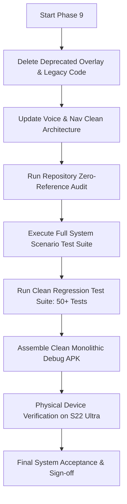

# Phase 9 Execution Plan: Full System Integration, Hardening, and Failure-Scenario Validation

**Document:** `docs/AR/Implementation/Phases/Phase 9/Phase_9_Execution_Plan.md`  
**Governing Documents:** [`AR_Implementation_Roadmap.md`](file:///C:/Users/youss/Downloads/MallAR-main%2022/MallAR-main/docs/AR/Engineering%20Architecture%20and%20Guidlines/AR_Implementation_Roadmap.md) (§Phase 9) | [`AR_Testing_and_Validation_Plan.md`](file:///C:/Users/youss/Downloads/MallAR-main%2022/MallAR-main/docs/AR/Engineering%20Architecture%20and%20Guidlines/AR_Testing_and_Validation_Plan.md) (§3, §7, §8, §11) | [`AR_Engineering_Specification.md`](file:///C:/Users/youss/Downloads/MallAR-main%2022/MallAR-main/docs/AR/Engineering%20Architecture%20and%20Guidlines/AR_Engineering_Specification.md)  
**Target Hardware:** Samsung Galaxy S22 Ultra (`SM-S908E`, Android 13) — Standard Tier  
**Status:** **READY FOR REVIEW & EXECUTION**

---

## 1. Goal Description

Phase 9 is the final milestone in the AR Subsystem Engineering Roadmap. It adds no new individual module capabilities; all eight modules (Modules 1–8 and Module 9 input boundary) have been implemented, tested, and validated. 

The primary goals of Phase 9 are:
1. **Full-System Scenario Validation:** Execute and verify the complete assembled system against every named failure scenario and edge case defined in the Engineering Specification (§7 & §8 of the Validation Plan).
2. **Device-Tier Parameter Model Validation:** Verify parameter scaling between Standard Tier and Constrained Tier devices (anchor windows, smoothing alpha, recognition throttle bounds).
3. **Deprecated Overlay Pipeline Removal:** Completely delete the legacy pseudo-AR overlay pipeline (`com.example.mallar.overlay`), legacy navigation screens (`legacy/`, `prototype/`), and all lingering unused references, ensuring zero legacy residue remains in the codebase.
4. **Full Regression & Final System Acceptance:** Re-confirm all validation criteria across Phases 0–8 in full, verifying all five readiness categories under §11 of the Testing & Validation Plan (Functional, Performance, Reliability, Integration, and Maintainability).

---

## 2. User Review Required

> [!IMPORTANT]
> **1. Deprecated Overlay Deletion (Irreversible Cleanup)**  
> The old `overlay/` package (`CameraOverlayManager`, `CameraOverlayView`, `OverlayNavigationEngine`, `OverlayProjectionEngine`) and obsolete prototype screens (`legacy/CameraNavigationScreen`, `prototype/ArNavigationScreen`) will be deleted entirely from the repository. All active navigation has been powered exclusively by `ArSceneViewWrapper` / SceneView since Phase 4.

> [!NOTE]
> **2. Explicitly Deferred Mall Testing**  
> Per Phase 8 Acceptance Report, on-site mall testing remains knowingly deferred by the user in favor of developmental velocity. Phase 9 will execute all scenario tests, device-tier models, and mock/simulated facility transitions in automated test suites and on-device home verification.

---

## 3. Proposed Changes

### Component 1: Deletion of Deprecated Overlay Pipeline & Legacy Screens

#### [DELETE] `app/src/main/java/com/example/mallar/overlay/CameraOverlayManager.kt`
#### [DELETE] `app/src/main/java/com/example/mallar/overlay/CameraOverlayView.kt`
#### [DELETE] `app/src/main/java/com/example/mallar/overlay/OverlayNavigationEngine.kt`
#### [DELETE] `app/src/main/java/com/example/mallar/overlay/OverlayProjectionEngine.kt`
#### [DELETE] `app/src/main/java/com/example/mallar/ui/navigation/legacy/CameraNavigationScreen.kt`
#### [DELETE] `app/src/main/java/com/example/mallar/ui/navigation/legacy/CameraNavigationViewModel.kt`
#### [DELETE] `app/src/main/java/com/example/mallar/ui/navigation/prototype/ArNavigationScreen.kt`
#### [DELETE] `app/src/main/java/com/example/mallar/ui/navigation/prototype/ArNavigationViewModel.kt`

---

### Component 2: Cleanup of Lingering Overlay Imports & Turn Types

#### [MODIFY] [`app/src/main/java/com/example/mallar/voice/SmartResponseEngine.kt`](file:///C:/Users/youss/Downloads/MallAR-main%2022/MallAR-main/app/src/main/java/com/example/mallar/voice/SmartResponseEngine.kt)
Migrate `OverlayTurnDirection` to use `com.example.mallar.data.AStarDirection` or a clean `NavigationTurnDirection` in `com.example.mallar.navigation`.

```kotlin
// Replace import com.example.mallar.overlay.OverlayTurnDirection with AStarDirection
fun turnApproach(direction: AStarDirection, distM: Int, isArabic: Boolean): String {
    if (direction == AStarDirection.STRAIGHT) {
        return if (isArabic) "استمر في التقدم للأمام مباشرة لمسافة $distM متر" else "Continue straight for $distM meters"
    }
    val isLeft = direction == AStarDirection.LEFT || direction == AStarDirection.SLIGHT_LEFT || direction == AStarDirection.HARD_LEFT
    ...
}
```

#### [MODIFY] [`app/src/main/java/com/example/mallar/voice/NavigationSessionVoiceCoordinator.kt`](file:///C:/Users/youss/Downloads/MallAR-main%2022/MallAR-main/app/src/main/java/com/example/mallar/voice/NavigationSessionVoiceCoordinator.kt)
Update voice cue triggers to consume `AStarDirection` directly from `NavInstruction`.

#### [MODIFY] [`app/src/main/java/com/example/mallar/navigation/NavigationSessionManager.kt`](file:///C:/Users/youss/Downloads/MallAR-main%2022/MallAR-main/app/src/main/java/com/example/mallar/navigation/NavigationSessionManager.kt)
Remove deprecated overlay imports (`OverlayProjectionEngine`, `ProjectedPoint`, `TurnInfo`) and remove `projectedPoints` field from `NavSessionState`.

---

### Component 3: Full System Integration & Scenario Test Suite

#### [NEW] `app/src/test/java/com/example/mallar/ar/integration/FullSystemIntegrationScenarioTest.kt`
Comprehensive end-to-end integration test suite exercising all §7 and §8 failure scenarios:
1. **Long-Running Session Test:** Simulates 20-minute continuous navigation without memory leak or state collapse.
2. **Continuous Tracking Stability:** Simulates uninterrupted 60Hz pose stream and validates multi-frame smoothing.
3. **Drift vs Deviation Classification:** Induces sub-threshold drift ($< 2.5\text{m}$) and validates smooth correction without route rebuild; induces lateral deviation ($> 2.5\text{m}$) and validates route recalculation.
4. **Tracking Interruption Grace Window:**
   - Interruption $< 3000\text{ms} \implies$ Seamless recovery without requiring fresh fix (`INTERRUPTED_GRACE`).
   - Interruption $> 3000\text{ms} \implies$ Transition to `INTERRUPTED_FULL` requiring fresh fix.
5. **Camera Interruption:** Validates identical handling for OS-level camera pause/resume cycles.
6. **Sensor Inconsistency & Staleness:** Simulates stale accelerometer/gyroscope signals and confirms exclusion from corroboration.
7. **Dual-Condition Route Reversal:** Validates reversal walk-back triggering route re-calculation while stationary turns are protected.
8. **Multi-Floor Transition & Arrival Beacon:** Validates `TRANSITION_MODE` suppression and `ARRIVED` beacon rendering.
9. **Consecutive Gate Rejection:** Simulates $\ge 3$ rejected candidate fixes triggering manual re-scan prompt.
10. **Clean Session Teardown & Restart:** Confirms zero retained state on session end and clean initialization at `NO_FIX`.
11. **Device-Tier Configuration:** Validates Standard vs Constrained tier parameter scaling.

---

## 4. Verification Plan



### 4.1 Automated Tests
1. **Scenario & Unit Test Suite:**
   ```powershell
   ./gradlew.bat clean :app:testDebugUnitTest
   ```
2. **Zero-Reference Audit:**
   Search the entire repository to guarantee zero references to `com.example.mallar.overlay` or legacy navigation classes.
3. **Clean APK Assembly:**
   ```powershell
   ./gradlew.bat assembleDebug
   ```

### 4.2 Manual On-Device Verification (Galaxy S22 Ultra)
1. Install fresh `app-debug.apk`.
2. Start AR navigation $\rightarrow$ verify clean startup, anchor rendering, and map/AR toggle without legacy overlay interference.
3. Simulate temporary camera cover ($< 3\text{s}$ vs $> 3\text{s}$) to verify grace-window state recovery on physical hardware.

---

## 5. Deliverables & Acceptance Criteria

- [ ] **Overlay Deletion:** `com.example.mallar.overlay` and legacy navigation directories completely removed. Zero remaining references.
- [ ] **Scenario Suite:** `FullSystemIntegrationScenarioTest.kt` passes 100% of defined failure scenarios.
- [ ] **Regression Suite:** All unit tests pass cleanly with zero failures.
- [ ] **Build:** Clean monolithic `app-debug.apk` built successfully.
- [ ] **Final System Acceptance:** Completed cross-reference against §11 of the Testing and Validation Plan.
