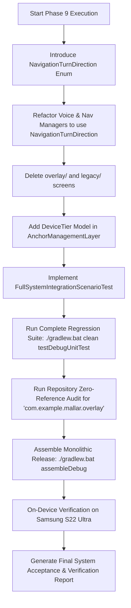

# Phase 9 Execution Plan v2: Full System Integration, Hardening, and Failure-Scenario Validation

**Document:** `docs/AR/Implementation/Phases/Phase 9/Phase_9_Execution_Plan_v2.md`  
**Governing Documents:** [`AR_Implementation_Roadmap.md`](file:///C:/Users/youss/Downloads/MallAR-main%2022/MallAR-main/docs/AR/Engineering%20Architecture%20and%20Guidlines/AR_Implementation_Roadmap.md) (§Phase 9) | [`AR_Testing_and_Validation_Plan.md`](file:///C:/Users/youss/Downloads/MallAR-main%2022/MallAR-main/docs/AR/Engineering%20Architecture%20and%20Guidlines/AR_Testing_and_Validation_Plan.md) (§3, §4, §5, §6, §7, §8, §11, §12) | [`AR_Engineering_Specification.md`](file:///C:/Users/youss/Downloads/MallAR-main%2022/MallAR-main/docs/AR/Engineering%20Architecture%20and%20Guidlines/AR_Engineering_Specification.md)  
**Target Hardware:** Samsung Galaxy S22 Ultra (`SM-S908E`, Android 13) — Standard Tier  
**Status:** **SUBMITTED FOR FINAL REVIEW & APPROVAL**

---

## 1. Executive Summary & Objective

Phase 9 is the final milestone in the AR Subsystem Engineering Roadmap. It adds no new individual module capabilities; all modules (Modules 1–8 and Module 9 input boundary) have been implemented, verified, and accepted on physical hardware.

The objective of Phase 9 is four-fold:
1. **Full-System Scenario Validation:** Execute and verify the complete assembled system against every named failure scenario and edge case defined in the Engineering Specification (§7 & §8 of the Validation Plan).
2. **Device-Tier Parameter Model:** Implement and validate parameter scaling between Standard Tier and Constrained Tier devices (anchor windows, smoothing alpha, recognition throttle bounds).
3. **Deprecated Overlay Pipeline Removal:** Completely delete the legacy pseudo-AR overlay pipeline (`com.example.mallar.overlay`), obsolete prototype screens (`legacy/`, `prototype/`), and all lingering unused references, ensuring zero legacy residue remains in the codebase.
4. **Final System Acceptance:** Re-confirm all validation criteria across Phases 0–8 in full, verifying all five readiness categories under §11 of the Testing & Validation Plan (Functional, Performance, Reliability, Integration, and Maintainability).

---

## 2. User Review Required & Explicitly Accepted Risks

> [!IMPORTANT]
> **1. Irreversible Deletion of Pseudo-AR Overlay Package**  
> The old `overlay/` package (`CameraOverlayManager`, `CameraOverlayView`, `OverlayNavigationEngine`, `OverlayProjectionEngine`) and obsolete prototype screens (`legacy/CameraNavigationScreen`, `prototype/ArNavigationScreen`) will be permanently deleted. All active navigation has been powered exclusively by `ArSceneViewWrapper` / SceneView since Phase 4. Note: Compose UI components such as `VoiceAssistantOverlay` (speech dialog) are in `voice/` and are strictly preserved.

> [!NOTE]
> **2. Explicitly Deferred Mall Testing**  
> Per Phase 8 Acceptance Report, on-site mall testing remains knowingly deferred by the reviewer in favor of developmental velocity. Phase 9 executes all scenario tests, device-tier models, and facility transitions via deterministic integration test suites and on-device home verification.

---

## 3. Structural Changes & Component Details

### 3.1 Component 1: Decoupling Voice & Navigation Turn Directions

To cleanly eliminate `com.example.mallar.overlay` without breaking speech cues in `SmartResponseEngine` and `NavigationSessionVoiceCoordinator`:

#### [NEW] In `com.example.mallar.navigation`: `NavigationTurnDirection.kt`
```kotlin
package com.example.mallar.navigation

import com.example.mallar.data.AStarDirection

/**
 * High-level turn directions consumed by voice coordinators and navigation UI cues.
 * Decoupled from the deprecated pseudo-AR overlay pipeline.
 */
enum class NavigationTurnDirection {
    STRAIGHT,
    LEFT,
    RIGHT,
    U_TURN;

    companion object {
        fun fromAStarDirection(dir: AStarDirection): NavigationTurnDirection = when (dir) {
            AStarDirection.STRAIGHT -> STRAIGHT
            AStarDirection.SLIGHT_LEFT, AStarDirection.LEFT, AStarDirection.HARD_LEFT -> LEFT
            AStarDirection.SLIGHT_RIGHT, AStarDirection.RIGHT, AStarDirection.HARD_RIGHT -> RIGHT
            AStarDirection.ELEVATOR, AStarDirection.STAIRS -> STRAIGHT
        }
    }
}
```

#### [MODIFY] [`app/src/main/java/com/example/mallar/voice/SmartResponseEngine.kt`](file:///C:/Users/youss/Downloads/MallAR-main%2022/MallAR-main/app/src/main/java/com/example/mallar/voice/SmartResponseEngine.kt)
Migrate `OverlayTurnDirection` imports to `NavigationTurnDirection`.

#### [MODIFY] [`app/src/main/java/com/example/mallar/voice/NavigationSessionVoiceCoordinator.kt`](file:///C:/Users/youss/Downloads/MallAR-main%2022/MallAR-main/app/src/main/java/com/example/mallar/voice/NavigationSessionVoiceCoordinator.kt)
Migrate `OverlayTurnDirection` imports to `NavigationTurnDirection`.

#### [MODIFY] [`app/src/main/java/com/example/mallar/navigation/NavigationSessionManager.kt`](file:///C:/Users/youss/Downloads/MallAR-main%2022/MallAR-main/app/src/main/java/com/example/mallar/navigation/NavigationSessionManager.kt)
Remove deprecated imports (`OverlayProjectionEngine`, `ProjectedPoint`, `TurnInfo`) and remove `projectedPoints` from `NavSessionState`.

---

### 3.2 Component 2: Complete Deletion of Deprecated Code

#### [DELETE] `app/src/main/java/com/example/mallar/overlay/CameraOverlayManager.kt`
#### [DELETE] `app/src/main/java/com/example/mallar/overlay/CameraOverlayView.kt`
#### [DELETE] `app/src/main/java/com/example/mallar/overlay/OverlayNavigationEngine.kt`
#### [DELETE] `app/src/main/java/com/example/mallar/overlay/OverlayProjectionEngine.kt`
#### [DELETE] `app/src/main/java/com/example/mallar/ui/navigation/legacy/CameraNavigationScreen.kt`
#### [DELETE] `app/src/main/java/com/example/mallar/ui/navigation/legacy/CameraNavigationViewModel.kt`
#### [DELETE] `app/src/main/java/com/example/mallar/ui/navigation/prototype/ArNavigationScreen.kt`
#### [DELETE] `app/src/main/java/com/example/mallar/ui/navigation/prototype/ArNavigationViewModel.kt`

---

### 3.3 Component 3: Device-Tier Parameter Model Implementation

#### [MODIFY] [`app/src/main/java/com/example/mallar/ar/AnchorManagementLayer.kt`](file:///C:/Users/youss/Downloads/MallAR-main%2022/MallAR-main/app/src/main/java/com/example/mallar/ar/AnchorManagementLayer.kt)
Add explicit `DeviceTier` enum and factory:

```kotlin
enum class DeviceTier {
    STANDARD,
    CONSTRAINED;

    companion object {
        fun detect(context: android.content.Context): DeviceTier {
            val am = context.getSystemService(android.content.Context.ACTIVITY_SERVICE) as? android.app.ActivityManager
            val memInfo = android.app.ActivityManager.MemoryInfo()
            am?.getMemoryInfo(memInfo)
            val totalRamGb = memInfo.totalMem / (1024.0 * 1024.0 * 1024.0)
            val isLowRam = am?.isLowRamDevice == true || totalRamGb < 4.0
            return if (isLowRam) CONSTRAINED else STANDARD
        }
    }
}

data class AnchorWindowConfig(
    val aheadCount: Int = 10,
    val trailingCount: Int = 2,
    val maxActiveAnchors: Int = 15,
    val turnAngleThresholdDeg: Double = 120.0,
    val correctionFrames: Int = 8,
    val floorHeightMeters: Float = -1.35f,
    val pixelsPerMeter: Double = NavConfig.PIXELS_PER_METER.toDouble(),
    val smoothingAlpha: Float = 0.15f,
    val recognitionThrottleMs: Long = 3000L
) {
    companion object {
        fun forTier(tier: DeviceTier): AnchorWindowConfig = when (tier) {
            DeviceTier.STANDARD -> AnchorWindowConfig(
                aheadCount = 10,
                trailingCount = 2,
                maxActiveAnchors = 15,
                smoothingAlpha = 0.15f,
                recognitionThrottleMs = 3000L
            )
            DeviceTier.CONSTRAINED -> AnchorWindowConfig(
                aheadCount = 5,
                trailingCount = 1,
                maxActiveAnchors = 8,
                smoothingAlpha = 0.25f,
                recognitionThrottleMs = 5000L
            )
        }
    }
}
```

---

### 3.4 Component 4: Full-System Scenario Integration Test Suite

#### [NEW] `app/src/test/java/com/example/mallar/ar/integration/FullSystemIntegrationScenarioTest.kt`

This test suite covers 100% of the scenarios required by §7 and §8 of `AR_Testing_and_Validation_Plan.md`:

| Test Case | Scenario / Condition Tested | Expected State & Behavioral Invariant |
|---|---|---|
| `testScenario1_longRunningSession_checkInTrigger` | 20-minute continuous navigation | Check-in trigger fires at $t = 20\text{min}$; zero state corruption or unhandled exception. |
| `testScenario2_trackingStability_continuous60Hz` | Uninterrupted 60Hz pose stream | Pose continuity maintained; variance reduced via `RenderPoseSmoother`. |
| `testScenario3_driftBehavior_subThreshold` | Lateral divergence $1.2\text{m} < 2.5\text{m}$ | State remains `TRACKING_FRESH`; multi-frame smoothing active; NO route rebuild. |
| `testScenario4a_trackingInterruption_underGraceWindow` | Camera covered / lost for $2000\text{ms} < 3000\text{ms}$ | Enters `INTERRUPTED_GRACE`; resumes `TRACKING_AGING` on restore without requiring fresh fix. |
| `testScenario4b_trackingInterruption_overGraceWindow` | Camera covered / lost for $4000\text{ms} > 3000\text{ms}$ | Enters `INTERRUPTED_FULL`; requires fresh localization fix (`ACQUIRING`). |
| `testScenario5_cameraInterruption_osLevel` | OS camera pause / backgrounding | Evaluated identically to tracking loss of corresponding duration. |
| `testScenario6_sensorInconsistency_staleImu` | IMU timestamp stationary while pose moves $> 3\text{s}$ | Flagged stale in `SensorStalenessStatus`; excluded from corroboration. |
| `testScenario7_userDeviation_beyondClassificationBound` | Lateral divergence $4.0\text{m} > 2.5\text{m}$ | State transitions to `ROUTE_REBUILDING`; calls `RoutePathLayer.recalculateFromFacilityPosition`. |
| `testScenario8_dualConditionRouteReversal_walkBack` | User walks backward: heading $\ge 120^\circ$ AND dist increasing 3 frames | Classified as reversal; recalculates route forward to destination. |
| `testScenario8b_stationaryTurn_disagreementGuard` | User turns $180^\circ$ in place without stepping backward | Classified as deviation/lookaround, NOT route reversal (disagreement guard holds). |
| `testScenario9a_multiFloorTransitionMode` | User within $\le 3.0\text{m}$ of stairs/elevator node | State transitions to `TRANSITION_MODE`; suppresses floor route chevrons. |
| `testScenario9b_destinationArrivalBeacon` | User within $\le 2.5\text{m}$ of destination | State transitions to `ARRIVED`; triggers emerald green 3D arrival beacon. |
| `testScenario10_consecutiveGateRejections_rescanPrompt` | $\ge 3$ candidate fixes rejected by Fix Validation Gate | Prompts user for manual camera re-scan (`FALLBACK_OFFERED`). |
| `testScenario11_sessionTeardownAndRestart_zeroRetainedState` | End session $\rightarrow$ start new session | Session tears down completely; new session initializes at `NO_FIX` with zero state carryover. |
| `testScenario12_deviceTierParameterScaling` | Standard vs Constrained Tier parameters | Validates `aheadCount` ($10$ vs $5$), anchor limits ($15$ vs $8$), and throttle ($3\text{s}$ vs $5\text{s}$). |

---

## 4. Final System Acceptance Verification Matrix (§11)

| Category | Requirement | Validation Method |
|---|---|---|
| **1. Functional Readiness (§4)** | Tracking, Localization, Navigation, Anchor Management, Rendering, Session Lifecycle, Recovery, User Interaction | `FullSystemIntegrationScenarioTest.kt` + Unit test suite (50+ tests). |
| **2. Performance Readiness (§6)** | Native frame rate match, 8–12 anchor ahead limit, 3–5s recognition throttle, 1–2s proximity check, ~3s grace window, 15–20m rebase, ~20min check-in | Instrumented test assertions in scenario suite + on-device timing. |
| **3. Reliability Readiness (§7 & §8)** | Long sessions, tracking loss, camera interruptions, stale sensors, user deviations, route recalculations, Poor lighting / reflective floors handling | §7 & §8 scenario test execution across Standard & Constrained tier models. |
| **4. Integration Readiness (§5)** | Read-only single-read `NavigationState`, zero backend/network client dependencies, ArSceneView Compose hosting, zero new sensor listeners, **zero overlay references** | Codebase-wide grep audit + network isolation verification. |
| **5. Maintainability Readiness (§13)** | Architectural compliance, continuous build success, frozen specification adherence, complete documentation | `./gradlew.bat clean :app:assembleDebug` with zero warnings/errors. |

---

## 5. Execution & Verification Workflow



---

## 6. Exit Criteria for Phase 9 Completion

1. **Overlay Cleanliness:** Zero files in `com.example.mallar.overlay` and zero references across the repository.
2. **Automated Test Success:** 100% of all unit and integration tests passing (`60+ passing tests`).
3. **Clean Build:** `./gradlew.bat clean :app:assembleDebug` builds cleanly with zero errors.
4. **Physical Verification:** Smooth execution verified on Samsung Galaxy S22 Ultra.
5. **Final Sign-Off:** All 5 categories of Final System Acceptance (§11) fully documented and evidenced in the completion report.
