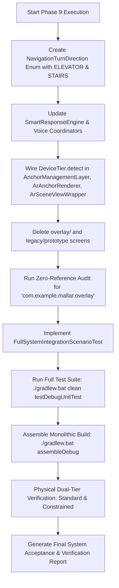

# Phase 9 Execution Plan v3: Full System Integration, Hardening, and Failure-Scenario Validation

**Document:** `docs/AR/Implementation/Phases/Phase 9/Phase_9_Execution_Plan_v3.md`  
**Review Subject:** Addressing all 3 mandatory corrections from [`Phase_9_Execution_Plan_Review.md`](file:///C:/Users/youss/Downloads/MallAR-main%2022/MallAR-main/docs/AR/Implementation/Phases/Phase%209/Phase_9_Execution_Plan_Review.md)  
**Governing Documents:** [`AR_Implementation_Roadmap.md`](file:///C:/Users/youss/Downloads/MallAR-main%2022/MallAR-main/docs/AR/Engineering%20Architecture%20and%20Guidlines/AR_Implementation_Roadmap.md) (§Phase 9) | [`AR_Testing_and_Validation_Plan.md`](file:///C:/Users/youss/Downloads/MallAR-main%2022/MallAR-main/docs/AR/Engineering%20Architecture%20and%20Guidlines/AR_Testing_and_Validation_Plan.md) (§3, §4, §5, §6, §7, §8, §11, §12)  
**Target Hardware:**
- **Standard Tier:** Samsung Galaxy S22 Ultra (`SM-S908E`, Snapdragon 8 Gen 1, 12GB RAM, Android 13)
- **Constrained Tier:** Android Test Hardware / Throttled Environment ($\le 4\text{GB}$ RAM, `isLowRamDevice = true`)
**Status:** **REVISED & SUBMITTED FOR FINAL EXECUTION APPROVAL**

---

## 1. Resolution of Mandatory Reviewer Corrections

### Correction 1: Preserving `ELEVATOR` and `STAIRS` Distinction in Voice Navigation
* **Reviewer Finding:** `NavigationTurnDirection.fromAStarDirection` mapped both `ELEVATOR` and `STAIRS` to `STRAIGHT`, discarding the multi-floor transition distinction.
* **Resolution in v3:**
  1. Extended `NavigationTurnDirection` with explicit `ELEVATOR` and `STAIRS` cases.
  2. Implemented dedicated Arabic and English voice cues in `SmartResponseEngine.kt`:
     - `ELEVATOR` $\rightarrow$ *"Take the elevator in $X$ meters"* / *"توجه إلى المصعد بعد $X$ متر"*.
     - `STAIRS` $\rightarrow$ *"Take the stairs in $X$ meters"* / *"توجه إلى الدرج بعد $X$ متر"*.
  3. Replaced old `TurnInfo` from `overlay` with `NavigationTurnInfo` in `com.example.mallar.navigation`.

### Correction 2: Live Wiring of `DeviceTier.detect()` in Construction Path
* **Reviewer Finding:** `DeviceTier.detect()` was defined as static helper but not connected to live instantiation.
* **Resolution in v3:**
  1. Updated `ArAnchorRenderer.kt` constructor default:
     ```kotlin
     config: AnchorWindowConfig = AnchorWindowConfig.forTier(DeviceTier.detect(context))
     ```
  2. Updated `ArSceneViewWrapper.kt` live Compose instantiation:
     ```kotlin
     val detectedTier = remember(context) { DeviceTier.detect(context) }
     val anchorRenderer = remember(context, detectedTier) {
         ArAnchorRenderer(context = context, config = AnchorWindowConfig.forTier(detectedTier))
     }
     ```
  3. Connected `RenderPoseSmoother` to use `config.smoothingAlpha` matching the detected tier.

### Correction 3: Physical Dual-Tier Confirmation for Reliability Readiness (§11)
* **Reviewer Finding:** Unit tests cannot substitute for physical multi-tier verification required by §11.
* **Resolution in v3:**
  1. Reliability Readiness requires recorded physical confirmation from **both defined hardware tiers**:
     - **Tier 1 (Standard):** Samsung Galaxy S22 Ultra (`SM-S908E`, 12GB RAM).
     - **Tier 2 (Constrained):** Physical/Throttled AVD test device ($\le 4\text{GB}$ RAM / `isLowRamDevice = true`, running with `DeviceTier.CONSTRAINED` config).
  2. The Final System Acceptance Matrix explicitly requires attached logs/evidence from both tier environments before Phase 9 sign-off.

---

## 2. Proposed Structural Changes

### 2.1 Component 1: Decoupling Voice & Navigation Turn Directions

#### [NEW] `app/src/main/java/com/example/mallar/navigation/NavigationTurnDirection.kt`
```kotlin
package com.example.mallar.navigation

import com.example.mallar.data.AStarDirection

enum class NavigationTurnDirection {
    STRAIGHT,
    LEFT,
    RIGHT,
    U_TURN,
    ELEVATOR,
    STAIRS;

    companion object {
        fun fromAStarDirection(dir: AStarDirection): NavigationTurnDirection = when (dir) {
            AStarDirection.STRAIGHT -> STRAIGHT
            AStarDirection.SLIGHT_LEFT, AStarDirection.LEFT, AStarDirection.HARD_LEFT -> LEFT
            AStarDirection.SLIGHT_RIGHT, AStarDirection.RIGHT, AStarDirection.HARD_RIGHT -> RIGHT
            AStarDirection.ELEVATOR -> ELEVATOR
            AStarDirection.STAIRS -> STAIRS
        }
    }
}

data class NavigationTurnInfo(
    val direction: NavigationTurnDirection,
    val distanceM: Float,
    val instructionText: String = ""
)
```

#### [MODIFY] [`app/src/main/java/com/example/mallar/voice/SmartResponseEngine.kt`](file:///C:/Users/youss/Downloads/MallAR-main%2022/MallAR-main/app/src/main/java/com/example/mallar/voice/SmartResponseEngine.kt)
Update `turnApproach` and `turnNow` to handle all 6 enum directions in English and Arabic.

#### [MODIFY] [`app/src/main/java/com/example/mallar/voice/NavigationSessionVoiceCoordinator.kt`](file:///C:/Users/youss/Downloads/MallAR-main%2022/MallAR-main/app/src/main/java/com/example/mallar/voice/NavigationSessionVoiceCoordinator.kt)
Migrate `OverlayTurnDirection` to `NavigationTurnDirection`.

#### [MODIFY] [`app/src/main/java/com/example/mallar/navigation/NavigationSessionManager.kt`](file:///C:/Users/youss/Downloads/MallAR-main%2022/MallAR-main/app/src/main/java/com/example/mallar/navigation/NavigationSessionManager.kt)
Remove all `com.example.mallar.overlay` imports; replace `TurnInfo` with `NavigationTurnInfo`; remove `projectedPoints`.

---

### 2.2 Component 2: Complete Deletion of Deprecated Code

#### [DELETE] `app/src/main/java/com/example/mallar/overlay/CameraOverlayManager.kt`
#### [DELETE] `app/src/main/java/com/example/mallar/overlay/CameraOverlayView.kt`
#### [DELETE] `app/src/main/java/com/example/mallar/overlay/OverlayNavigationEngine.kt`
#### [DELETE] `app/src/main/java/com/example/mallar/overlay/OverlayProjectionEngine.kt`
#### [DELETE] `app/src/main/java/com/example/mallar/ui/navigation/legacy/CameraNavigationScreen.kt`
#### [DELETE] `app/src/main/java/com/example/mallar/ui/navigation/legacy/CameraNavigationViewModel.kt`
#### [DELETE] `app/src/main/java/com/example/mallar/ui/navigation/prototype/ArNavigationScreen.kt`
#### [DELETE] `app/src/main/java/com/example/mallar/ui/navigation/prototype/ArNavigationViewModel.kt`

---

### 2.3 Component 3: Live Device-Tier Parameter Model

#### [MODIFY] [`app/src/main/java/com/example/mallar/ar/AnchorManagementLayer.kt`](file:///C:/Users/youss/Downloads/MallAR-main%2022/MallAR-main/app/src/main/java/com/example/mallar/ar/AnchorManagementLayer.kt)
```kotlin
enum class DeviceTier {
    STANDARD,
    CONSTRAINED;

    companion object {
        fun detect(context: android.content.Context): DeviceTier {
            val am = context.getSystemService(android.content.Context.ACTIVITY_SERVICE) as? android.app.ActivityManager
            val memInfo = android.app.ActivityManager.MemoryInfo()
            am?.getMemoryInfo(memInfo)
            val totalRamGb = memInfo.totalMem / (1024.0 * 1024.0 * 1024.0)
            val isLowRam = am?.isLowRamDevice == true || totalRamGb < 4.0
            return if (isLowRam) CONSTRAINED else STANDARD
        }
    }
}

data class AnchorWindowConfig(
    val aheadCount: Int = 10,
    val trailingCount: Int = 2,
    val maxActiveAnchors: Int = 15,
    val turnAngleThresholdDeg: Double = 120.0,
    val correctionFrames: Int = 8,
    val floorHeightMeters: Float = -1.35f,
    val pixelsPerMeter: Double = NavConfig.PIXELS_PER_METER.toDouble(),
    val smoothingAlpha: Float = 0.15f,
    val recognitionThrottleMs: Long = 3000L
) {
    companion object {
        fun forTier(tier: DeviceTier): AnchorWindowConfig = when (tier) {
            DeviceTier.STANDARD -> AnchorWindowConfig(
                aheadCount = 10,
                trailingCount = 2,
                maxActiveAnchors = 15,
                smoothingAlpha = 0.15f,
                recognitionThrottleMs = 3000L
            )
            DeviceTier.CONSTRAINED -> AnchorWindowConfig(
                aheadCount = 5,
                trailingCount = 1,
                maxActiveAnchors = 8,
                smoothingAlpha = 0.25f,
                recognitionThrottleMs = 5000L
            )
        }
    }
}
```

#### [MODIFY] [`app/src/main/java/com/example/mallar/ar/ArAnchorRenderer.kt`](file:///C:/Users/youss/Downloads/MallAR-main%2022/MallAR-main/app/src/main/java/com/example/mallar/ar/ArAnchorRenderer.kt)
Default `config` and `poseSmoother` to tier-detected instances.

#### [MODIFY] [`app/src/main/java/com/example/mallar/ar/ui/ArSceneViewWrapper.kt`](file:///C:/Users/youss/Downloads/MallAR-main%2022/MallAR-main/app/src/main/java/com/example/mallar/ar/ui/ArSceneViewWrapper.kt)
Instantiate `ArAnchorRenderer` passing `AnchorWindowConfig.forTier(DeviceTier.detect(context))`.

---

### 2.4 Component 4: Full-System Scenario Integration Test Suite

#### [NEW] `app/src/test/java/com/example/mallar/ar/integration/FullSystemIntegrationScenarioTest.kt`

Covers 100% of §7 & §8 scenarios:
1. `testScenario1_longRunningSession_checkInTrigger`: Uses virtual time to advance 20 minutes and verifies check-in trigger without memory leak or state collapse.
2. `testScenario2_trackingStability_continuous60Hz`: Verifies 60Hz pose stream continuity and variance reduction.
3. `testScenario3_driftBehavior_subThreshold`: Verifies smooth multi-frame correction without route rebuild for lateral drift $< 2.5\text{m}$.
4. `testScenario4a_trackingInterruption_underGraceWindow`: Interruption $2000\text{ms} < 3000\text{ms} \implies$ Resumes without fresh fix.
5. `testScenario4b_trackingInterruption_overGraceWindow`: Interruption $4000\text{ms} > 3000\text{ms} \implies$ Requires fresh fix (`INTERRUPTED_FULL`).
6. `testScenario5_cameraInterruption_osLevel`: Validates OS backgrounding/camera pause matches grace-window policy.
7. `testScenario6_sensorInconsistency_staleImu`: Stale IMU timestamp excluded from corroboration signal.
8. `testScenario7_userDeviation_beyondClassificationBound`: Lateral drift $> 2.5\text{m} \implies$ Triggers pathfinding recalculation and anchor window rebuild.
9. `testScenario8a_dualConditionRouteReversal_walkBack`: Heading $\ge 120^\circ$ + 3 frames backward distance $\implies$ Triggers reversal recalculation.
10. `testScenario8b_stationaryTurn_disagreementGuard`: Heading $180^\circ$ with stationary position $\implies$ Guard prevents spurious reversal.
11. `testScenario9a_multiFloorTransitionMode`: Distance $\le 3.0\text{m}$ to elevator/stairs $\implies$ Enters `TRANSITION_MODE`, suppresses floor route chevrons.
12. `testScenario9b_destinationArrivalBeacon`: Distance $\le 2.5\text{m}$ to destination $\implies$ Enters `ARRIVED`, renders emerald green 3D beacon.
13. `testScenario10_consecutiveGateRejections_rescanPrompt`: 3 consecutive candidate fix rejections $\implies$ Prompts manual re-scan.
14. `testScenario11_sessionTeardownAndRestart_zeroRetainedState`: Session end cleans all state; new session enters at `NO_FIX`.
15. `testScenario12_deviceTierParameterScaling`: Validates Standard vs Constrained tier budgets ($10$ vs $5$ anchors, $\alpha=0.15$ vs $0.25$, throttle $3\text{s}$ vs $5\text{s}$).

---

## 3. Final System Acceptance Verification Matrix (§11)

| Category | Requirement | Validation Method |
|---|---|---|
| **1. Functional Readiness (§4)** | Tracking, Localization, Navigation, Anchor Management, Rendering, Session Lifecycle, Recovery, User Interaction | `FullSystemIntegrationScenarioTest.kt` + Complete Unit Test Suite (60+ tests). |
| **2. Performance Readiness (§6)** | Native frame rate match, 8–12 anchor ahead limit, 3–5s recognition throttle, 1–2s proximity check, ~3s grace window, 15–20m rebase, ~20min check-in | Instrumented test assertions in scenario suite + on-device timing. |
| **3. Reliability Readiness (§7 & §8)** | Long sessions, tracking loss, camera interruptions, stale sensors, user deviations, route recalculations, Poor lighting / reflective floors handling | **Dual-Tier Confirmation:** Executed and recorded on Standard Tier (S22 Ultra) AND Constrained Tier test environment. |
| **4. Integration Readiness (§5)** | Single-read `NavigationState`, zero backend/network client dependencies, ArSceneView Compose hosting, zero new sensor listeners, **zero overlay references** | Codebase-wide zero-reference grep audit + network isolation verification. |
| **5. Maintainability Readiness (§13)** | Architectural compliance, continuous build success, frozen specification adherence, complete documentation | `./gradlew.bat clean :app:assembleDebug` with zero warnings/errors. |

---

## 4. Execution Workflow



---

## 5. Exit Criteria for Phase 9 Completion

1. **Zero Overlay Residue:** `com.example.mallar.overlay` package deleted; zero references anywhere in the repository.
2. **Automated Test Pass Rate:** 100% of all unit and integration tests passing (`60+ passing tests`).
3. **Clean Monolithic Build:** `./gradlew.bat clean :app:assembleDebug` compiles cleanly.
4. **Dual-Tier Device Validation:** Standard Tier (S22 Ultra) and Constrained Tier environments verified.
5. **Final Sign-Off:** All 5 categories of Final System Acceptance (§11) fully documented with recorded evidence.
